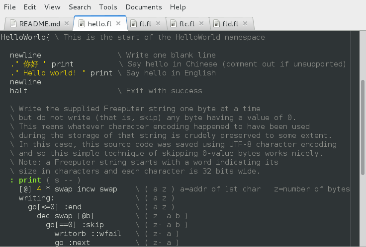
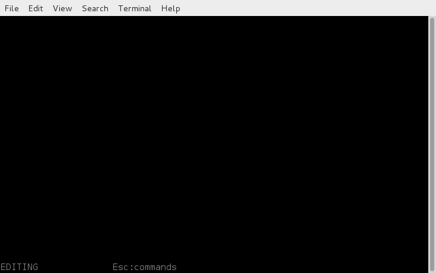
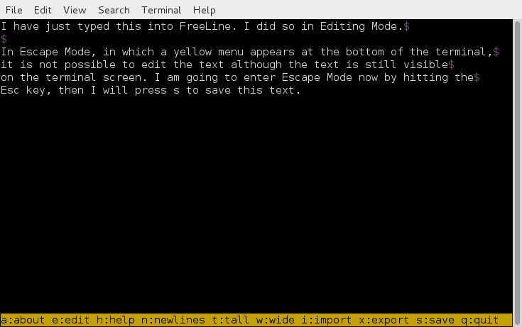
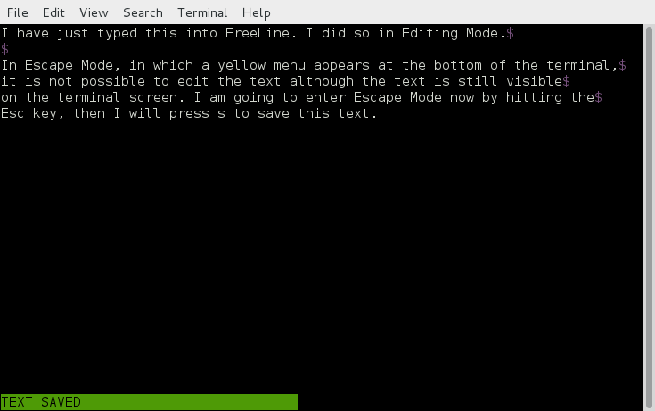
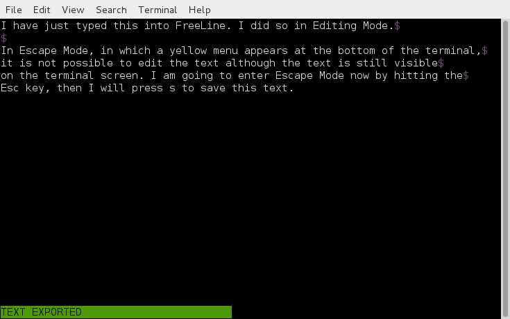
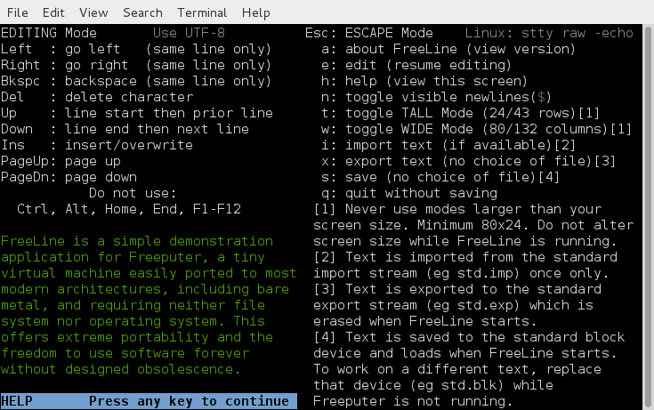
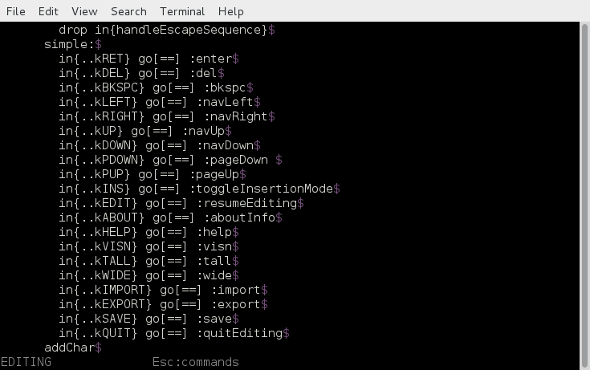
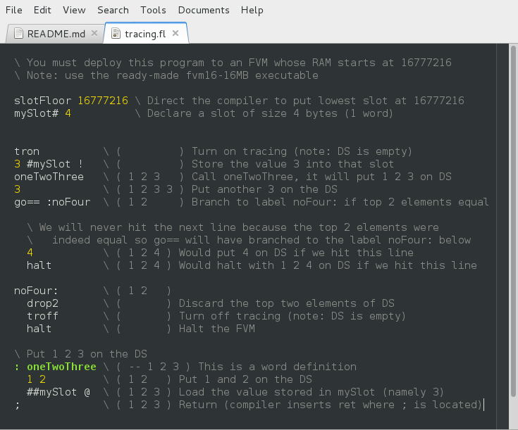

<meta http-equiv="content-type" content="text/html;charset=utf-8">

# Freeputer

Freeputer ( ) \[ \] { } forever free

## What is Freeputer?

Freeputer is a free computer. Free as in freedom.

Freeputer is a tiny virtual machine easily ported to most modern architectures, including bare metal, and requiring neither file system nor operating system. This offers extreme portability and the freedom to use software forever without designed obsolescence.

* Freeputer is a virtual machine: the Freeputer Virtual Machine (FVM).
* Freeputer is a self-hosted, self-contained software development platform.
* Freeputer is a platform for modular software that lasts forever.
* Freeputer is a powerful platform for bare metal computing.
* Freeputer is a user's computer not a vendor's computer.
* Freeputer supports the freedom of the user.
* Freeputer is a not an operating system.

## History

Freeputer is brand new. It was released on 8 August 2015. It should be considered betaware.

Freeputer and Freelang are the product of several years of independent research by Robert Gollagher (in Brisbane, Australia). Although the current implementation is brand new, the general design concept has been well proven by earlier prototypes. The Freelang language is stable and productive.

## Software

This distribution contains:

* **fvm** : an FVM 1.0 for x86 32-bit Linux (`fvm.s, assemble-fvm.sh`)
* **FreeLine** : a text editor for Freeputer (`fl.fl`)
* **flc** : a Freelang compiler for Freeputer (`flc.fl, flc.sh`)
* **fld** : a Freelang decompiler for Freeputer (`fld.fl, fld.sh`)
* **fvmtest** : a suite of unit tests for Freeputer (`fvmtest.fl, fvmtest.sh`)
* **flx** : a Freelang cross compiler and decompiler (`flx.rb`)

All of these components are for FVM 1.0.

## Reading this document

This is a technical document intended for software developers.

You *must* set your web browser or text editor to view UTF-8 character encoding before reading this document, otherwise it will not display properly.

Please read the whole document in order. Important information explained in earlier sections is not repeated in later sections as it is assumed you have read from the beginning. If you intend to make serious use of Freeputer you will also need to read the extensive comments in all of the source code listed in the [Software](#software) section above. You should also study the source code to explore Freelang programming techniques.

## Hello world

Here is the output from a simple Freeputer program:


As you can see, the program greets the user in Chinese and English.

The program was written in Freelang. Freelang is a stack-oriented, concatenative, compiled language for Freeputer. It is the first language available for the FVM. It is a fairly low-level language, whose core vocabulary is essentially that of the FVM instruction set, but it is surprisingly productive and capable. It is inherently extensible. Its syntax uses reverse Polish notation (RPN).

Here is the Freelang program that produced the above output:

```forth

\ ============================================================================
\                               HELLO WORLD
\           A demonstration of output in Chinese and English,
\                  written in Freelang for Freeputer.
\
\               You must view this source code in UTF-8
\
\   The Chinese output will only work if your terminal emulator is set to use
\   UTF-8 character encoding and supports the display of Chinese characters.
\   If not then simply comment out the line: ." 你好 " print
\
\   Note: you must compile this program with flc not flx.
\
\ ============================================================================
HelloWorld{ \ This is the start of the HelloWorld namespace

  newline                 \ Write one blank line
  ." 你好 " print          \ Say hello in Chinese (comment out if unsupported)
  ." Hello world! " print \ Say hello in English
  newline
  halt                    \ Exit with success

  \ Write the supplied Freeputer string one byte at a time
  \ but do not write (that is, skip) any byte having a value of 0.
  \ This means whatever character encoding happened to have been used
  \ during the storage of that string is crudely preserved to some extent.
  \ In this case, this source code was saved using UTF-8 character encoding
  \ and so this simple technique of skipping 0-value bytes works nicely.
  \ Note: a Freeputer string starts with a word indicating its
  \ size in characters and each character is 32 bits wide.
  : print ( s -- )
    [@] 4 * swap incw swap    \ ( a z ) a=addr of 1st char   z=number of bytes
    writing:                  \ ( a z )
      go[<=0] :end            \ ( a z )
        dec swap [@b]         \ ( z- a b )
          go[==0] :skip       \ ( z- a b )
            writorb ::wfail   \ ( z- a )
            go :next          \ ( z- a )
        skip:                 \ ( z- a b )
          drop                \ ( z- a )
        next:                 \ ( z- a )
          inc swap            \ ( a+ z- )
          go :writing         \ ( a+ z- )
    end:                      \ ( a z )
      drop2                   \ ( )
      newline                 \ ( )
  ;

  \ Write a newline character
  : newline ( -- ) 10 writorb ::wfail ;

  \ Exit point upon I/O error
  wfail: halt

}HelloWorld \ end of namespace

```

And here is what Freelang looks like with syntax highlighting:



Freelang is not Forth but its syntax is similar enough that Forth highlighting generally works quite well for Freelang. This allows you to leverage existing tools. The above screenshot was taken in [gedit](https://en.wikipedia.org/wiki/Gedit) 3.4.2 set to Forth highlight mode.

## How can I try Freeputer?

Please see the [Quick Start](#quick-start) section below.

The Quick Start steps are:

1. [Review](#review-the-system-requirements) the System Requirements
2. [Download](#download-freeputer) Freeputer
3. [Run](#run-the-freeline-text-editor) the FreeLine text editor
4. [Run](#run-the-freeputer-unit-tests) the Freeputer unit tests
5. [Use](#use-flx-the-freelang-cross-compiler) flx, the Freelang cross compiler
6. [Use](#use-flc-the-freelang-compiler) flc, the Freelang compiler
7. [Use](#use-fld-the-freelang-decompiler) fld, the Freelang decompiler
8. [Assemble](#assemble-the-fvm) the FVM
9. [Review](#review-the-fvm-instruction-set) the FVM instruction set
10. [Learn](#learn-freelang) Freelang

Note: the Quick Start steps *must* be read in the above order.

## Why use Freeputer?

### Free as in freedom

Freeputer is free software. This means you have the [freedoms](http://www.gnu.org/philosophy/free-sw.html) to run, copy, distribute, study, change and improve the software according to the terms of the GNU General Public License (Version 3). These freedoms are important but unfortunately are not enough in themselves to allow you to use your own software and data forever. Therefore Freeputer offers additional freedoms outlined below.

### Modular not monolithic

Freeputer is simple and modular. Complex, monolithic software is fundamentally at odds with freedom because it takes large teams of experts to successfully make changes to it or to port it to new hardware. Thus, as far as the individual is concerned, there is limited freedom. True freedom in computing therefore requires that software be written as simple portable modules with very few dependencies. Freeputer makes this easy to achieve.

### Write once, run forever

Freeputer is extremely portable. The minimal dependencies of the FVM are easily satisfied by almost any modern 32-bit microcontroller plus a few I/O drivers. There is no need for sophisticated hardware, a host operating system or even a file system. Therefore your investment in writing a software module to run on the FVM is protected in that you can easily move that module to run on an FVM implementation on some other platform, even after current platforms no longer exist.

### Hardware freedom

Freeputer does not require a C compiler. It is easy for a single software engineer to create an implementation of the FVM using only assembly language. Freeputer thus provides extreme freedom in choice of hardware.

### Development freedom

Freeputer is a self-hosted software development platform. This is best explained by analogy. The JVM was released in 1995 with a compiler called javac for a language called Java that is compiled to JVM bytecode. The FVM was released in 2015 with a compiler called flc for a language called Freelang that is compiled to FVM bytecode.

flc is a self-hosted compiler; that is, it is written in Freelang, runs on the FVM and can compile itself. You can use the FreeLine text editor (accessed from a terminal emulator) to write Freelang source code on one Freeputer instance, compile that source code with flc on a second Freeputer instance, then deploy and run your newly compiled Freeputer program on a third Freeputer instance. It is convenient to coordinate this from the Linux command line but such coordination could instead easily be done by a fourth Freeputer instance supporting a few simple commands and connected to a physical terminal, or a single Freeputer instance could do it all.

In principle, all you need to be able to continue to support, maintain, enhance and create Freeputer software in future is Freeputer itself.

### Freedom from undefined behaviour

Freeputer has no undefined internal behaviour. That is, there is no undefined behaviour in Freeputer except for that which could reasonably be expected to originate from an I/O device (such as an appropriate but unpredictable I/O error or a random number being properly received by an input device); any other undefined behaviour is a bug in an FVM implementation.

This is a major advantage of Freeputer as a reliable platform for running software and of Freelang as a reliable language for writing software. This safety is fundamental to the whole concept of Freeputer and is built into the FVM instruction set.

For example, adding two signed integers in C can result in undefined behaviour (because in C the behaviour upon signed integer overflow is *undefined*). Instead of allowing undefined internal behaviour, Freeputer stops. That is, the FVM automatically traps any situation (such as integer overflow) that would otherwise result in undefined internal behaviour; the FVM never allows undefined internal behaviour. An FVM instance can be configured to do one of three things when a trap occurs: halt, reboot or reset. In contrast, traps never occur as a result of I/O errors; instead, an I/O operation branches upon whatever the I/O device deems to be an error.

Freeputer is also free of *unexpected* internal behaviour. That is, its behaviour is always as would intuitively be expected in ordinary mathematics, otherwise it traps. For example, adding 1 to the `int` 2147483647 in Java gives the result -2147483648; although this behaviour is *defined* it is intuitively *unexpected* and therefore is an insidious source of bugs (mainly because programmers often do not determine whether addition would cause or has caused such overflow.) Adding 1 to 2147483647 in Freeputer (by using the `+` operator, representing the `ADD` instruction) always results in trapMathOverflow at runtime and therefore causes the execution of your program to stop rather than allowing program execution to continue after such an insidious, silent error. Of course, you could write a bignum library to perform arithmetic on larger numbers.

### Freely extensible

Freeputer can be extended in a modular manner. Such extension uses devices. An FVM implementation must provide a minimum of 2 input streams (stdin = standard input, stdimp = standard import), 3 output streams (stdout = standard output, stdexp = standard export, stdtrc = standard trace), and 1 standard block device (stdblk) but may optionally support up to a maximum of 2147483647 input streams, 2147483647 output streams, 2147483648 block devices, and 0 or more memory-mapped devices. An FVM implementation can be extended either by modifying the behaviour of stdin, stdimp, stdout or stdexp or by providing additional I/O devices.

For example, you might connect a printing service to stdexp, a random number generator to stdimp, provide a clock as a new block device, provide a math coprocessor as a new block device, provide a graphical display as a memory-mapped device, or enable a networking connection as an input stream paired with an output stream.

Of course, it is better to connect several simple Freeputer instances than to have one complex Freeputer instance; dependencies on monolithic or proprietary systems should be minimized; and excessive dependencies should be avoided.

Input streams have positive IDs. Output streams have negative IDs. They are typically paired. The reserved IDs are: stdin is 1, stdout is -1; stdimp is 2, stdexp is -2. stdtrc has no ID. For block devices: stdblk is 0; any other block devices have positive IDs.

Note that memory-mapped devices are permitted to read only from the MAP area of system memory and are not permitted to write to any part of system memory. Also note that the behaviour of stdblk, unlike that of other block devices, must always be that of a simple read/write, addressable storage device that faithfully stores and retrieves values.

### From tiny to large

Freeputer can be sized as desired.

The FVM is a 32-bit stack-based virtual machine with 3 stacks: the data stack (DS), the return stack (RS) and the software stack (SS). The DS and RS are similar to those of Forth. The SS is a simple auxiliary stack that facilitates software development.

Stack elements are 32-bit words. Typical FVM implementations should support a maximum of 32 elements per stack but this is not mandatory; an FVM implementation may support a lesser (within reason) or greater number of stack elements. Stack elements are always treated as signed two's-complement 32-bit integers for all arithmetic operations and for addressing.

The maximum possible address space of Freeputer memory is from byte 0 to byte 2147483647; ROM always begins at 0; RAM (if any) begins immediately after ROM; MAP (if any) begins immediately after RAM. Negative addresses are not permitted. MAP is an optional area of memory in which one or more memory-mapped *output* devices may reside. The term MAP (memory access point, a backronym) is simply prounounced "map". The maximum possible address space of any one block device is from byte 0 to byte 2147483647; smaller block devices are common. All non-zero sizings of memory areas and block devices must be an even multiple of 4 bytes.

Although the standard block device (stdblk) is mandatory it can be of 0 size, as can RAM and MAP. ROM only needs to be large enough to hold whatever program you wish your Freeputer instance to run; program execution automatically begins at address 0 in ROM upon FVM start up.  Therefore the smallest practical FVM instance would provide a few dozen bytes of ROM and little else. You could run such a teensy FVM on a feeble microcontroller. At the other end of the scale, a large FVM instance could have 2 GiB of memory (divided between ROM, RAM and MAP) and a 2 GiB stdblk. This could be supplemented by up to 2147483647 additional 2 GiB block devices.

Most Freeputer instances are small to medium in size. For example: fld, the Freelang decompiler, runs on a small FVM instance having 16 kiB of ROM (and needs only 20 *bytes* of RAM); flc, the Freelang compiler, requires less than 64 kiB of ROM and runs on an FVM instance having 16 MiB of RAM (more than sufficient for it to compile itself).

### Simple and effective

Although Freelang is a fairly low-level language with no standard library, its simplicity and extensibility make it surprisingly productive. Freelang is a stack-oriented concatenative language that allows you to effortlessly define your own words and makes it easy to create your own domain specific languages (essentially just vocabularies). It supports functional programming. It is not object oriented. And Freelang development does not require an operating system (neither at compile time nor at runtime).

You can get things done with surprisingly little coding. Take, for example, FreeLine: a simple text editor (with UTF-8 support) accessed from a terminal emulator. It is less than 2000 lines of Freelang (including extensive comments) yet is more than capable of importing, editing and exporting its own source code. The compiled program is less than 32 kiB. Even flc, the self-hosted Freelang compiler, is less than 4000 lines of Freelang (again including extensive comments). It is less than 64 kiB compiled.

Whether you are writing portable software or programming an embedded device, Freeputer allows you to get things done simply and effectively.

## Freeputer limitations

1. **Freeputer is not an operating system.** Freeputer is a virtual machine not an operating system. Freeputer is intended to make it easy to write software as simple portable modules with very few dependencies. Doing so does not require any operating system. Indeed the use of a complex operating system is often inimical to that goal. However, you could write a simple guest operating system to run on Freeputer and it might be fun and useful to do so.

1. **Freeputer is not 64 bit.** Freeputer is a 32-bit computer. This is primarily a mathematical decision made to *reduce complexity*. From a mathematical point of view, quite independent of whatever technology Freeputer happens to be running on, the fact that the address space of FVM memory is limited to 2147483648 bytes tends to limit complexity. That is enough space for 100 million instructions plus data. That is enough. Preferably programs should never be that large as gigantic programs are essentially impossible to maintain. Furthermore, using such a convenient but reasonably small stack-element size reduces footprint. Perhaps in two decades 1024-bit computers may be common, or the whole concept of sizing a computer by CPU register size may have become technologically irrelevant. Yet there will still be a place for a small, portable virtual machine that is easy to implement, providing the software it runs is *simple*, portable, modular and useful.

1. **Freeputer is not natively floating point.** The FVM instruction set includes bitwise operations and integer arithmetic but has no floating-point instructions. The FVM is therefore easy to implement on hardware that has no native support for floating-point operations. This *maximises hardware freedom*. If you need fast floating-point operations you should either delegate them to an external system or implement devices (streams, block devices or memory-mapped devices) to support them. The Freelang compiler does not support floating-point literals but you could easily implement slow floating-point operations (including bignums) in Freelang.

## Versioning

In the initial release of Freeputer on 8 August 2015 each of the included [Software](#software) components were individually designated as version 1.0.0.0; nevertheless they should be considered betaware. The version numbers of these components may at times differ from each other as they are individually maintained and enhanced.

The four levels of versioning are called:

* major release (e.g. **1** as from **1**.0.0.0)
* significant release (e.g. **1.0** as from 1.**0**.0.0)
* minor release  (e.g. **1.0.0** as from 1.0.**0**.0)
* patch  (e.g. **1.0.0.0** as from 1.0.0.**0**)

The FVM platform itself, as an implied standard rather than as an implementation, can in effect also be considered to be versioned. It has only a major release number and a significant release number. Any significant changes to the FVM platform standard that might seriously affect the ability of existing FVM bytecode to run on that platform, such as a change in its instruction set, shall as a minimum be indicated by an increase in its significant release number. No such changes are currently foreseen.

The major and significant version numbers of any FVM implementations provided in this distribution match those of the implied FVM platform standard they implement. This is also true of any Freelang compilers, FVM bytecode decompilers and FVM test suites provided in this distribution.

## Quick Start

The Quick Start steps are:

1. [Review](#review-the-system-requirements) the System Requirements
2. [Download](#download-freeputer) Freeputer
3. [Run](#run-the-freeline-text-editor) the FreeLine text editor
4. [Run](#run-the-freeputer-unit-tests) the Freeputer unit tests
5. [Use](#use-flx-the-freelang-cross-compiler) flx, the Freelang cross compiler
6. [Use](#use-flc-the-freelang-compiler) flc, the Freelang compiler
7. [Use](#use-fld-the-freelang-decompiler) fld, the Freelang decompiler
8. [Assemble](#assemble-the-fvm) the FVM
9. [Review](#review-the-fvm-instruction-set) the FVM instruction set
10. [Learn](#learn-freelang) Freelang

Note: the Quick Start steps *must* be read in the above order.

### 1. Review the System Requirements

This Freeputer distribution is for 32-bit Linux running on x86 hardware.

*Note: this is in no way a limitation of Freeputer. It just so happens that this particular implementation of the FVM is for x86 32-bit Linux. It is hoped that the community will make [free](http://www.gnu.org/philosophy/free-sw.html) FVM implementations available for other platforms in the future.*

### 2. Download Freeputer

Download and unzip the Freeputer distribution from [GitHub](https://github.com/RobertGollagher/Freeputer) or [Bitbucket](https://bitbucket.org/RobertGollagher/freeputer/src), then follow the instructions below. Note: these instructions were prepared on Debian 7.8.

### 3. Run the FreeLine text editor

#### Introduction

FreeLine is the first demonstration application for Freeputer. It is a basic text editor, sufficient for writing short documents or editing Freelang source code. More correctly, it is a *software module for text editing*. It only does text editing. Nothing else. And it does so in a manner almost completely devoid of dependencies. It requires neither operating system nor file system. In fact it does not even support the concept of a document having a name. Such things would be the responsibility of other software modules or of an external system. It just so happens that the particular implementation of the FVM that FreeLine here is running on uses Linux as that external system.

How does it work? When FreeLine is started it loads whatever text exists at the start of the standard block device (stdblk) of the FVM instance it is running on. It then allows you to edit this text. If you choose to save your changes to the text, FreeLine safely persists those changes back to stdblk (here the binary file 'std.blk'). When you are happy with the text you can export it to standard export (stdexp, here the text file 'std.exp'). FreeLine also has an import function that allows you to import text from standard import (stdimp, here the text file 'std.imp'). Thus you can edit, save, import and export text.

#### Instructions

1. Open a terminal emulator (GNOME Terminal is recommended).
2. Set your terminal size to exactly 80 columns x 24 rows.
3. Change directory to your unzipped Freeputer directory.
4. Change directory to the editor app: `cd apps/editor`
5. Start FreeLine: `./fl.sh`



6. FreeLine starts in Editing Mode. This is indicated by the word EDITING shown in the status row at the bottom of the terminal. In this mode you can create and edit text. To issue commands (such as to save, import or export) you must enter Escape Mode. To enter Escape Mode hit **Esc**. This will make a yellow menu appear.



7. Now press **s** to save your text. The message TEXT SAVED will appear. Your text has been saved to stdblk. You can now immediately continue editing your text.
<br/><br>Note: Be aware that FreeLine never automatically saves your changes. It is up to you to remember to save your work. If you make changes that you do not wish to keep, simply exit FreeLine without saving.



8. Enter Escape Mode by hitting **Esc** then press **x** to export your text. The message TEXT EXPORTED will appear. Your text has been exported to stdexp. You can now immediately continue editing your text.
<br/><br>Note: If you now open 'std.exp' in some other text editor you will see that your text was indeed exported to that text file. WARNING: Be aware that the next time you start FreeLine the contents of 'std.exp' will automatically be erased.



9.  Enter Escape Mode by hitting **Esc** then press **h** to view help. Using this help screen as a guide you can now explore the other functions of FreeLine.



10. Now quit FreeLine: enter Escape Mode by hitting **Esc** then press  **q**.

11. In preparation for importing it into FreeLine, copy the Freelang source code for the FreeLine text editor itself to the standard import file 'std.imp'. Assuming that you are still in the apps/editor directory, do this by:
<br/><br/> `cp ../../dev/freelang/editor/src/fl.fl std.imp`

12. Now restart FreeLine by: `./fl.sh`

13. Move to the end of your text by repeatedly hitting the down arrow then hit **Enter** a couple of times so as to leave a blank line between your existing text and where the imported text will begin. Now enter Escape Mode by hitting **Esc** then press **i** to do the import. The entire source code for the FreeLine text editor will now be imported. The message TEXT IMPORTED will appear.

14. Page down through the source code by hitting **PageDn** repeatedly. What you are looking at is the Freelang program for the FreeLine text editor itself. This what the Freelang language looks like.



You can use [gedit](https://en.wikipedia.org/wiki/Gedit) in Forth highlight mode to view Freelang with syntax highlighting. Usually the only thing not properly highlighted are those particular multiple-line comments which in Freelang begin and end with triple parentheses.


You have now learned how to edit, save, import and export text in FreeLine. Although FreeLine is of course not being presented here as a serious competitor to existing text editors, it is a signficant demonstration of what can be achieved on the Freeputer platform. Remember that FreeLine has no operating system dependencies and will run on a bare metal FVM implementation. It is a simple editor free of distractions.

FreeLine currently has some known limitations:

1. There is no way to quickly **delete an entire text** from within FreeLine. The workaround is to quit FreeLine, then at the Linux command line copy the supplied 'std.blk.empty' to 'std.blk', then restart FreeLine.

2. There is no way to **switch between different documents**. The workaround is to quit FreeLine, then at the Linux command line copy 'std.blk' to some memorable filename such as 'document2.blk', then copy a previously made copy such as 'document1.blk' to 'std.blk', then restart FreeLine.

3. The rendering algorithm used by FreeLine is accurate but needlessly slow. Rendering needs to be refactored. In the meantime the screen renders itself a little slowly. This is not a problem when typing but it is noticeable during pagination and makes pasting more than a few words (via the paste function of your terminal emulator) extremely slow. The workaround is to **import instead of pasting**.

4. FreeLine is not intended for **very large documents**. In order to keep its design as simple as possible it does not use a gap buffer for its document model. Nevertheless on a desktop PC it has no problem editing 4000 lines of source code.

##### A note on Freeputer performance

Slow rendering is due merely to a poor algorithm in FreeLine. Nevertheless, this is an opportune time to mention that although Freeputer is an *extremely* lightweight platorm it is only a *moderately* fast platform. This is partly because the FVM enforces, in everything it does, an absolute lack of undefined internal behaviour. This trades speed for safety.

Different FVM implementations greatly differ in speed. For example, a fast FVM might be optimized for speed but as a result be larger in footprint and not support tracing. Such a fast FVM can count the signed integers from 2147483647 down to 0 (*with* checks to trap any undefined behaviour) in about 9 seconds on an i5 3 GHz desktop computer. This compares (*without* any checks to trap any undefined behaviour) to roughly: 1 second for C; 12 seconds for Lua; over 240 seconds for Python; over 260 seconds for Ruby. Were just-in-time compilers to become available for the FVM then the performance gap between Freeputer and C would narrow. Of course, you could use an FVM I/O device written in C or assembly language to carry out some task with great speed.

### 4. Run the Freeputer unit tests

#### Introduction

The Freelang program fvmtest is a suite of unit tests for the FVM. Its purpose is to verify that an FVM implementation is working correctly. It does this by running on that FVM implementation and testing each instruction in the FVM instruction set. In doing so it causes the FVM to restart more than 200 times, verifying that traps occurred when they should have done. Nevertheless it only takes a few seconds to run.

The Freelang source code for these tests is found at: 'dev/freelang/fvmtest/src/fvmtest.fl'. If you would like to understand in detail what the tests do and how to use them to test your own FVM implementation, please read that source code. It is extensively commented. Please note that the test coverage, although extensive, is not yet complete.

fvmtest demonstrates how to write unit tests for Freelang code. Although it might be nice to have one, you do not need a unit-testing framework. You can roll your own quite easily, using functional and concatenative programming techniques.

#### Instructions

1. Open a terminal emulator (GNOME Terminal is recommended).
2. Change directory to your unzipped Freeputer directory.
3. Change directory to the fvmtest area: `cd dev/fvm/x86/fvmtest`
4. Start fvmtest: `./fvmtest.sh`

This will produce a very large test report (over 1000 lines long) in the terminal (most but not all of which will also be in 'std.trc'). In the terminal you should see that the report begins with something like...

```
Freeputer

Running fvmtest test suite...

testWALL             : expecting trap...

HIT WALL          
 just before:     
0000128c ret               ( ) [ ] { } 

                     : pass
testLIT              : expecting trap...

```

...followed by a very large number of error messages. These are normal and to be expected. The tests intentionally cause traps. You will notice that many of the error messages display the state of the three stacks in the FVM: the data stack (DS), whose contents are shown within parentheses, the software stack (SS), whose contents are shown within square brackets, and the return stack (RS), whose contents are shown within braces. Incidentally, this explains the Freeputer logo `( ) [ ] { }`. It depicts the three stacks of the FVM. The report should end with something like:

```
testIllegalOpcode    : expecting trap...

ILLEGAL OPCODE    
 just before:     
0000abe8 ===      00000001 ( ) [ ] { } 

                     : pass

OK     : The FVM restarted 225 times as expected
OK     : ( ) [ ] { n } as expected
OK     : All tests passed
```

If you do not see `OK     : All tests passed` then the FVM implementation has failed the test suite. It either failed at least one test or stopped prematurely.

Consider the report. From it you will gain an impression that there are many dozens of instructions in the FVM instruction set and that a great many of them are capable of causing traps such as stack overflows, stack underflows, math overflow, divide by zero, and so on. These traps prevent program execution continuing after such unrecoverable errors and comprehensively guard against undefined internal behaviour.

### 5. Use flx, the Freelang cross compiler

**Please read this exercise even if you plan to skip it, as this section contains important information about Freelang and Freeputer that you will need to understand in order to write Freelang programs.**

#### Introduction

The principal official Freelang compiler, flc, is a self-hosted compiler; that is, it is written in Freelang, runs on the FVM and can compile itself. However, before flc could be created it was first necessary to write a cross compiler, written in another language and running on another platform. Otherwise it would have been impossible to compile the Freelang source code for flc for the first time. That cross compiler was and is flx.

flx was written in Ruby on x86 32-bit Linux. It should work on 32-bit little-endian platforms running Ruby 1.9.3. If you don't have Ruby you can just use flc instead, although sometimes the cross compiler is more convenient (see 'flx.rb' for details).

Freeputer is **little endian** with respect to how it arranges the individual bytes of a word in program cells, in memory, in block devices and in communication with I/O devices.

You will note that Freelang is a stack-oriented concatenative language that uses reverse Polish notation (RPN). If you are not familiar with such languages, take a quick look at the Wikipedia page for [Forth](https://en.wikipedia.org/wiki/Forth_%28programming_language%29).

#### Instructions

1. Open a terminal emulator (GNOME Terminal is recommended).
2. Change directory to your unzipped Freeputer directory.
3. Change directory as follows: `cd dev/xcompiler/ruby`
4. Here create an empty called 'add.fl' by: `touch add.fl`
5. Open 'add.fl' in your favourite text editor and copy and paste the following into it. Then save the file and exit your text editor.

        \ A simple Freelang program that adds 3 to 2 and leaves
        \   the result, namely 5, on the data stack.

        2 3 + halt

6. Compile 'add.fl' by: `./flx.rb add.fl rom.fp`
7. rom.fp now contains your compiled program as FVM bytecode.

With a hex editor you would now see that rom.fp is a binary file of size 28 bytes, consisting of 7 words each 32-bits wide and having the values:

```
0x00000001
0x00000002
0x00000001
0x00000003
0x000000c9
0x000000fe
0x00000000
```

These values correspond to FVM opcodes and literals as follows:

```
LIT
2
LIT
3
ADD
HALT
WALL
```

The meaning of this is:

```
Push the literal 2 onto the data stack
Push the literal 3 onto the data stack
Replace the top two elements of the data stack with their sum
Halt the FVM
Trap!
```

The second-last opcode, `0x000000fe`, is the HALT instruction. It represents a program-requested halt. It corresponds to the Freelang reserved word 'halt'. Upon encountering it the FVM will halt indicating success.

The last opcode, `0x00000000`, is the WALL instruction. It is automatically inserted by the Freelang compiler. Its purpose here is program overflow protection. If program flow ever hit this WALL the FVM would immediately trap (with a trapWall) because program flow should never under any circumstances hit a WALL. If it has done so it means there is either a bug in the program or a bug in the FVM.

There is of course a much easier way to inspect a compiled Freelang program: decompile it. There are two ways to decompile. Either you can use the self-hosted decompiler, fld, or you can use flx since it is not only a compiler but also a decompiler. When you invoke flx with only one argument it acts as a decompiler. Do this now: `./flx.rb rom.fp`

This decompiles the specified bytecode file to a text file suffixed with '.fpd' (meaning Freeputer program decompiled), in this case 'rom.fp.fpd', whose contents are:

```
000000000 00000000 lit                          0x00000001
000000004 00000004 2                            0x00000002
000000008 00000008 lit                          0x00000001
000000012 0000000c 3                            0x00000003
000000016 00000010 +                            0x000000c9
000000020 00000014 halt                         0x000000fe
000000024 00000018 ===                          0x00000000
```

The columns here are:

1. Program cell address (decimal)
2. Program cell address (hexadecimal)
3. Freelang reserved word name or decimal literal value
4. Cell value (hexadecimal)

By now you will have noticed that all FVM opcodes are in fact 32 bits wide, as are all literals. Thus the term 'FVM bytecode' is loosely used and perhaps 'FVM wordcode' would be more descriptive. The huge advantage of this scheme is that it is **simple and easy to implement**, not only for the virtual machine itself (on multiple platforms) but also for compilers, decompilers, software libraries and software tools. Furthermore, if space were ever really a problem then you could simply compress programs and have an FVM implementation that decompressed its programs on the fly. Nevertheless, the entire FVM instruction set is not large and consists of far fewer than 256 opcodes.

##### Using map.info or std.trc

When you compile a Freelang program with flx there are two informational files produced as well as the actual compiled program itself. The first is 'debug.flx'; you can ignore this file, it is only useful for debugging the cross compiler. The second is 'map.info'; this file is extremely important because it is of great assistance in debugging Freelang programs. (The equivalent output from flc is found in 'std.trc'.) Here is its content:

```
flx.rb Freeputer Freelang cross compiler
add.fl
Program Compiled

  ---------------------
INSTRUCTIONS          = 5
  Simple              = 3
  Complex             = 2
LABELS                = 0
  Refs                = 0
WORDS                 = 0
  Refs                = 0
CONSTANTS             = 0
  Refs                = 0
SLOTS                 = 0
  Refs                = 0
Unnamed STRINGS       = 0
Named   STRINGS       = 0
  Refs                = 0
  ---------------------
    Instruction cells = 7
         String cells = 0
           Data cells = 0
         Program size = 7 words
       Program extent = 28 bytes
               From   = 0
                 To   = 27
            RAM usage = 0 bytes
  ---------------------

WORDS

LABELS

SLOTS

STRINGS

ANONYMOUS STRINGS
  ---------------------
```

As you can see it shows a detailed breakdown of program structure. In this example it is of little use since our program does not contain any words (that is, functions), labels, constants, slots (that is, variables) or strings. However, it does show us that the program contains 2 complex instructions and 3 simple instructions. A complex instruction is one that occupies two program cells: the first cell being an opcode (e.g. `0x00000001` = LIT) and the second cell being a literal value or address (e.g. `0x00000002`). A simple instruction is an opcode and occupies only one program cell (e.g. `0x000000fe` = HALT).

'map.info' is invaluable as it lists under the sections WORDS, LABELS, SLOTS, STRINGS and ANONYMOUS STRINGS the program cell address of each instance of those entities, along with other useful information. You can learn about this by experimenting.

The following is the 'map.info' created by compiling 'fl.fl', the Freelang source code for the FreeLine text editor. Note: all but the first 5 lines of each section have been redacted.


```
flx.rb Freeputer Freelang cross compiler
fl.fl
Program Compiled

  ---------------------
INSTRUCTIONS          = 2504
  Simple              = 1001
  Complex             = 1503
LABELS                = 363
  Refs                = 299
WORDS                 = 177
  Refs                = 485
CONSTANTS             = 91
  Refs                = 253
SLOTS                 = 25
  Refs                = 210
Unnamed STRINGS       = 69
Named   STRINGS       = 15
  Refs                = 15
  ---------------------
    Instruction cells = 4007
         String cells = 3077
           Data cells = 0
         Program size = 7084 words
       Program extent = 28336 bytes
               From   = 0
                 To   = 28335
            RAM usage = 16777096 bytes
               From   = 16777216
                 To   = 33554311
  ---------------------

WORDS
000000052 00000034 init {FreeLine} 
000000372 00000174 load {FreeLine} 
000000540 0000021c show {FreeLine} 
000000556 0000022c edit {FreeLine} 
000001660 0000067c import {FreeLine}
...


LABELS
000000052 00000034 init () {FreeLine} 
000000372 00000174 load () {FreeLine} 
000000540 0000021c show () {FreeLine} 
000000556 0000022c edit () {FreeLine} 
000000564 00000234 skipMsg (edit) {FreeLine} 
...

SLOTS
016777216 01000000 txtspace () {FreeLine} 
033554216 01ffff28 cols () {FreeLine} 
033554220 01ffff2c rows () {FreeLine} 
033554224 01ffff30 pFblk () {FreeLine} 
033554228 01ffff34 pTxt () {FreeLine}
... 

STRINGS
000018236 0000473c ABOUT_MODE () {FreeLine}:"ABOUT     Press any key to co"...
000017644 000044ec EDIT_MODE () {FreeLine}:"EDITING              Esc:comma"...
000017792 00004580 EDIT_MODE_W () {FreeLine}:"EDITING WIDE       Esc:comma"...
000018088 000046a8 EDIT_MODE_T () {FreeLine}:"EDITING TALL       Esc:comma"...
000017940 00004614 EDIT_MODE_WT () {FreeLine}:"EDITING TALL WIDE Esc:comma"...
...

ANONYMOUS STRINGS
000018556 0000487c 1: "FreeLine, a text editor for Fr"...
000018716 0000491c 2: "Copyright (C) 2015 Robert Goll"...
000018868 000049b4 3: "This program is free software:"...
000019152 00004ad0 4: "it under the terms of the GNU "...
000019436 00004bec 5: "the Free Software Foundation, "...
...
  ---------------------
```

The columns are:

1. Program cell address (decimal)
2. Program cell address (hexadecimal)
3. Name of word, label, slot or string
4. String literal (partial)

The names within braces are namespaces. Thus the words `init`,  `load`, `show`, `edit` and `import` belong to the namespace `FreeLine`. Namespaces cannot be nested.

You will notice that for each word the compiler automatically creates a corresponding label. This greatly facilitates functional programming.

The names within parenthesis are wordspaces. Thus the label `skipMsg` belongs to the wordspace `edit` within the namespace `FreeLine`; that is, `skipMsg` is a local label located within the word `edit` which in turn is located within the namespace `FreeLine`. Wordspaces cannot be nested; that is, a word cannot be defined inside the definition of another word.

The entries in each section are sequential. Therefore you can deduce the size of each entity. For example, the word `init` starts at program cell address 52; the next word, `load`, starts at program cell address 372; therefore the word (that is, function) `init` occupies 320 bytes (that is, 80 words; that is, 80 program cells) in the compiled program. This is especially useful for understanding slots. A slot is a contiguous area of RAM assigned to a variable name in a Freelang program; you can see that the slot `txtspace` is very large (almost 16 MiB) whereas the slot `cols` is just one word (4 bytes) in size.

### 6. Use flc, the Freelang compiler

#### Introduction

The principal official Freelang compiler is flc, a self-hosted compiler; that is, it is written in Freelang, runs on the FVM and can compile itself. Whenever reasonably possible you should use flc not flx. This is because flc is more actively maintained and more regularly tested by actual use than is flx. Where the behaviour of flc differs from that of flx, the behaviour of flc should be taken to be the correct behaviour unless obviously a bug. Indeed there are a few known bugs in flx (they are minor; see comments in 'flx.rb').

Using flc is much the same as using the flx cross compiler. Of course, the two compilers normally produce an absolutely identical compiled program; it would be a compiler bug if they did not. The equivalent information to that found in 'map.info' is sent by flc to standard trace (stdtrc); that is, it can be found in the text file 'std.trc'. That information is extremely useful for debugging Freelang programs. Its format is slightly different in that it only shows numbers in decimal (not hexadecimal) but the information is the same.

Ensure you have read the [previous section](#use-flx-the-freelang-cross-compiler) before proceeding.

For further information see the extensive comments in:

* 'dev/freelang/compiler/src/flc.fl'
* 'dev/freelang/compiler/src/flc.sh'
* 'dev/xcompiler/ruby/flx.rb'
* 'dev/fvm/x86/src/fvm.s'
* 'dev/fvm/x86/src/assemble-fvm.sh'

You will note that, apart from 'flc.sh', several other files are present in the 'apps/compiler' directory. These files constitute the FVM and its devices; some of these are automatically created when the FVM first runs.

##### A note on deployment

When you compile a Freelang program you should nearly always compile it to a file called 'rom.fp' since the FVM will automatically load the contents of that file into ROM upon start up; it will then run your program starting at ROM address 0.

Therefore to deploy your compiled program simply place your newly compiled 'rom.fp' file in a directory containing:

1. A *suitably sized* FVM executable *for your program* (such as perhaps the ready-made 'fvm16-0kB' or 'fvm16-16MB'); if your program uses slots (variables) then the FVM's RAM space must start at or below the value specified by the `slotFloor` directive in your program.

2. A zero-filled 'std.blk' file of the exact size expected by that FVM executable for its standard block device.

3. An empty file called 'std.imp'. This will be used by the FVM as the source of data for its standard import device (stdimp).

See the comments near the end of 'dev/fvm/x86/src/fvm.s', in its TRAPS: STREAMS section, for how to create 'std.blk' and 'std.imp'.

See also the CONSTANTS section near the start of 'dev/fvm/x86/src/fvm.s' for how to configure the sizing of an FVM instance. See the comments in 'dev/fvm/x86/src/assemble-fvm.sh' for how to [assemble](#assemble-the-fvm) a new FVM instance.

#### Instructions

1. Open a terminal emulator (GNOME Terminal is recommended).
2. Change directory to your unzipped Freeputer directory.
3. Change directory as follows: `cd apps/compiler`
4. Create an empty file called 'add.fl' in the work subdirectory by: `touch work/add.fl`
5. Open 'work/add.fl' in your favourite text editor and copy and paste the following into it. Then save the file and exit your text editor.

        \ A simple Freelang program that adds 3 to 2 and leaves
        \   the result, namely 5, on the data stack.

        2 3 + halt

6. Compile 'work/add.fl' by: `./flc.sh work/add.fl work/rom.fp`
<br/><br/>**WARNING: Be very careful that you compile to 'work/rom.fp' and not accidentally to 'rom.fp' otherwise you will destroy the compiler.**
<br/><br/>The compiled flc compiler resides in 'apps/compiler/rom.fp' and if you accidentally overwrite it or accidentally delete it you will no longer be able to compile. To recover you can either copy 'dev/freelang/compiler/bin/rom.fp' to 'apps/compiler/rom.fp' or use the [flx](#use-flx-the-freelang-cross-compiler) cross compiler to recompile flc from 'dev/freelang/compiler/src/flc.fl'.

7. 'work/rom.fp' now contains your compiled program as FVM bytecode unless there was an error during compilation. You *must* check 'std.trc' to see if there was an error during compilation as errors are *not* reported to the terminal.

##### The compiler compiling itself

The flc compiler can easily compile itself. Simply follow the above instructions but substitute 'flc.fl' for 'add.fl'. That is, copy 'dev/freelang/compiler/src/flc.fl' to 'apps/compiler/work/flc.fl' and then compile as above. After you have *very carefully* checked that the compile did indeed succeed, you then disregard the above warning and intentionally manually copy the newly compiled flc compiler present in 'apps/compiler/work/rom.fp' over the old compiled flc compiler present in 'apps/compiler/rom.fp'. It is wise to first back up the original 'apps/compiler/rom.fp' in case you need to roll back.

### 7. Use fld, the Freelang decompiler

#### Introduction

fld is a self-hosted decompiler for Freelang programs. It is written in Freelang and runs on the FVM. It is one of two tools you can use to decompile compiled Freelang programs. The other tool is [flx](#use-flx-the-freelang-cross-compiler).

Please ensure you have read about [flx](#use-flx-the-freelang-cross-compiler) before proceeding, as that section explains how to read decompiler output. The decompiler output produced by fld differs slightly in format from that produced by flx but the information is essentially the same.

#### Instructions

1. Open a terminal emulator (GNOME Terminal is recommended).
2. Change directory to your unzipped Freeputer directory.
3. Change directory as follows: `cd apps/decompiler`
4. Copy the compiled Freelang program, that you wish to decompile, to the work subdirectory. Usually this will be a file called 'rom.fp'. Assuming that is the case, a copy of it should now reside in 'apps/decompiler/work/rom.fp'.
5. Decompile the file by: `./fld.sh work/rom.fp`

fld sends its decompiler output to stdtrc. Therefore you will now find the decompiler output in 'apps/decompiler/std.trc'.

Here is the fld decompiler output for the 'add.fl' program:

```
fld.fl decompiler
DECOMPILED PROGRAM:

0 :   : lit
4 :   : 2
8 :   : lit
12 :   : 3
16 :   : +
20 :   : halt
24 :   : ===

```

The columns are:

1. Program cell address (decimal)
2. Character value (only within ASCII range) or blank
3. Freelang reserved word name or decimal literal value

### 8. Assemble the FVM

#### Introduction

Freeputer does not require a C compiler. That is, it is easy for a single software engineer to create an implementation of the FVM using only assembly language. Freeputer thus provides extreme freedom in choice of hardware. For example, you could implement a new CPU in an FPGA and port the FVM to it using only an assembler.

To demonstrate this freedom, and for reasons of performance, simplicity and size, the initial FVM implementation supplied with this Freeputer distribution is written in x86 assembly language for 32-bit Linux. The executable is easily smaller than 32 kiB.

You do not have to assemble the FVM from source. Instead you can use one of the ready-made FVM executables provided with this Freeputer distribution. They are found in 'dev/fvm/x86/bin' (and also in the subdirectories of 'apps' where you have already been using them to run FreeLine, flc and fld). They include:

* **fvm16-0kB**: 16 kiB ROM, 16 kiB RAM, 0 kiB MAP, 0 kiB stdblk
* **fvm16-0MB**: 16 MiB ROM, 16 MiB RAM, 0 MiB MAP, 0 MiB stdblk
* **fvm16-16MB**: 16 MiB ROM, 16 MiB RAM, 0 MiB MAP, 16 MiB stdblk
* **fvm16-16MB-nt**: same as fvm16-16MB but *no tracing* (thus better performance)
* **fvm16-16MB-sr-append**: same as fvm16-16MB but configured to *soft reset* rather than halt upon a trap, and configured to *append* to 'std.trc' rather than truncating 'std.trc' upon start up; this is a special FVM instance only used by fvmtest

It is very helpful to examine the applications beneath the 'apps' directory (flc, fld and FreeLine) and their source code under 'dev/freelang'. Pay particular attention to the scripts used to start those applications, the FVM executables they use, and the `slotFloor` directives in their Freelang source code. You will soon understand how different applications are best suited to different FVM sizings and how they are configured and started; this can serve as a guideline for your own Freeputer applications.

#### Prerequisites

You must have the GNU assembler (as) and the GNU linker (ld) installed. That is, you must have GNU Binutils installed. See 'assemble-fvm.sh' for details.

#### Instructions

If you wish to assemble an FVM instance:

1. Open a terminal emulator (GNOME Terminal is recommended).
2. Change directory to your unzipped Freeputer directory.
3. Change directory as follows: `cd dev/fvm/x86/src`
4. Copy 'fvm.s' to a safe location so you can roll back if you need to.
5. Open 'fvm.s' in your favourite text editor. This is the x86 assembly language source for the FVM. Carefully read the comments in the ASSEMBLER DIRECTIVES and CONSTANTS section near the start of the file. If you are happy with the current configuration you can skip to the next step. Otherwise, make changes to achieve the FVM sizing you desire and to enable or disable tracing. Save your changes, close the file and exit your text editor. You are now ready to assemble a new FVM executable.
6. Read the instructions in 'assemble-fvm.sh'. By default it is configured to assemble the FVM for production. Leave it so. (Only if you wish to assemble the FVM for the purpose of debugging the FVM executable itself, follow the instructions in 'assemble-fvm.sh' to comment and uncomment the appropriate lines.)
7. Assemble and link the FVM executable by: `./assemble-fvm.sh`

Unless there was an error this will produce:

* build/fvm = the VM executable (ready for [deployment](#a-note-on-deployment))
* build/fvm.o = object file (you can discard this)

Note: you may now rename your newly created 'fvm' executable to some memorable name that helps to indicate its sizing and configuration.

## 9. Review the FVM instruction set

There are 149 instructions in the FVM instruction set: 37 complex instructions (consisting of two program cells, the second of which is a literal or address) and 112 simple instructions (consisting of one program cell).

The simple instructions are WALL (opcode 0) and the 111 opcodes from 145 to 255 inclusive; in the future if further simple instructions are ever added to the instruction set they would start at 144 and grow downwards. The complex instructions are the 37 opcodes from 1 to 37 inclusive; in the future if further complex instructions are ever added to the instruction set they would start at 38 and grow upwards. It is intended that the FVM instruction set should never contain more than 256 instructions. The existing set of 149 instructions is stable and has proven to be quite sufficient for most purposes.

The instruction set is a complex instruction set rather than a minimal instruction set because comprehensive testing has demonstrated that using a complex instruction set *dramatically* improves FVM performance. Nevertheless the instruction set is only of moderate size, predominantly simple, and easy to implement.

A program cell is a little-endian two's-complement 32-bit word (4 bytes). Nevertheless compiled Freeputer programs are loosely called 'FVM bytecode'. More accurately they can be called 'FVM wordcode'.

Stack elements are always 32 bits wide. Stack elements are always treated as signed two's-complement 32-bit integers for all arithmetic operations and for addressing.

All instructions that manipulate or depend upon a stack can cause a trap related to stack underflow or stack overflow of that stack. All arithmetic instructions can cause trapMathOverflow. Instructions that do division can cause trapDivideByZero. All memory read operations can cause trapMemBounds. All memory write operations can cause trapRAMBounds. All bitshifting operations can cause trapXsBitshift. A trapPcOverflow occurs if the program counter (that is, program flow) goes beyond program memory, for example due to a branch or jump. For a complete list of traps please see TRAPS section near the end of the source code of 'dev/fvm/x86/src/fvm.s'.

Except LIT and CALL, all FVM instructions have an equivalent reserved word in Freelang. Those reserved words together form the core vocabulary of Freelang.

The complete list below shows:

1. Opcode number
2. FVM instruction name
3. Equivalent reserved word in Freelang
4. Software stack ( -- ), data stack [ -- ] and return stack { -- } state changes;
<br/>in the stack diagrams 'n' means number, 'b' means byte (a word with only its least significant byte having a non-zero value), 'a' means address, 'r' means return address
5. Notes; 'cv' means "the value in the next program cell"

The terms "branch" and "jump" can be used as synonyms. However, "branch" is often used to mean "to conditionally branch while *preserving* at least one stack operand used to evaluate that condition," whereas "jump" is often used to mean "to unconditionally branch, or to conditionally branch after *consuming* all stack operands used to evaluate that condition." This explains the parallel series of instructions beginning with BR and J.

The constant TRUE is 1. The constant FALSE is 0.

The following list is for reference. You do not need to memorize it now. You should focus on learning the Freelang names (e.g. remember the reserved word **go** not JMP). Learn them one at a time as you begin writing Freelang programs. After a while it is quite easy to remember most of them. It is illegal to redefine a reserved word in Freelang.


```

Simple instruction (1)
======================

0. WALL : === ( -- ) [ -- ] { -- }  
This instruction is used to end data blocks (see DATA) and  
also inserted by the Freelang compiler prior to word declarations  
and at the end of a program.  
Note: trapWall occurs if hit (protection against program overflow).  
Note: the FVM automatically fills system memory with WALLs (0s) upon start up.


Complex instructions (37)
=========================

1.   LIT ( -- n1 ) [ -- ] { -- }  
push cv to DS

2.   CALL ( -- ) [ -- ] { -- r1 }  
push return address to RS then jump to cv

3.   JMP : go ( -- ) [ -- ] { -- }  
jump to cv

4.   BRGZ : go[>0] ( n1 -- n1 ) [ -- ] { -- }  
if n1 > 0 then branch to cv

5.   BRGEZ : go[>=0] ( n1 -- n1 ) [ -- ] { -- }  
if n1 >= 0 then branch to cv

6.   BRZ : go[==0] ( n1 -- n1 ) [ -- ] { -- }  
if n1 == 0 then branch to cv

7.   BRNZ : go[!=0] ( n1 -- n1 ) [ -- ] { -- }  
if n1 != 0 then branch to cv

8.   BRLEZ : go[<=0] ( n1 -- n1 ) [ -- ] { -- }  
if n1 <= 0 then branch to cv

9.   BRLZ : go[<0] ( n1 -- n1 ) [ -- ] { -- }  
if n1 < 0 then branch to cv

10.  BRG : go[>] ( n1 n2 -- n1 ) [ -- ] { -- }  
if n1 > n2 then branch to cv

11.  BRGE : go[>=] ( n1 n2 -- n1 ) [ -- ] { -- }  
if n1 >= n2 then branch to cv

12.  BRE : go[==] ( n1 n2 -- n1 ) [ -- ] { -- }  
if n1 == n2 then branch to cv

13.  BRNE : go[!=] ( n1 n2 -- n1 ) [ -- ] { -- }  
if n1 != n2 then branch to cv

14.  BRLE : go[<=] ( n1 n2 -- n1 ) [ -- ] { -- }  
if n1 <= n2 then branch to cv

15.  BRL : go[<] ( n1 n2 -- n1 ) [ -- ] { -- }  
if n1 < n2 then branch to cv

16.  JGZ : go>0 ( n1 -- ) [ -- ] { -- }  
if n1 > 0 then jump to cv

17.  JGEZ : go>=0 ( n1 -- ) [ -- ] { -- }  
if n1 >= 0 then jump to cv

18.  JZ : go==0 ( n1 -- ) [ -- ] { -- }  
if n1 == 0 then jump to cv

19.  JNZ : go!=0 ( n1 -- ) [ -- ] { -- }  
if n1 != 0 then jump to cv

20.  JLEZ : go<=0 ( n1 -- ) [ -- ] { -- }  
if n1 <= 0 then jump to cv

21.  JLZ : go<0 ( n1 -- ) [ -- ] { -- }  
if n1 < 0 then jump to cv

22.  JG : go> ( n1 n2 -- ) [ -- ] { -- }  
if n1 > n2 then jump to cv

23.  JGE : go>= ( n1 n2 -- ) [ -- ] { -- }  
if n1 >= n2 then jump to cv

24.  JE : go== ( n1 n2 -- ) [ -- ] { -- }  
if n1 == n2 then jump to cv

25.  JNE : go!= ( n1 n2 -- ) [ -- ] { -- }  
if n1 != n2 then jump to cv

26.  JLE : go<= ( n1 n2 -- ) [ -- ] { -- }  
if n1 <= n2 then jump to cv

27.  JL : go< ( n1 n2 -- ) [ -- ] { -- }  
if then n1 < n2 jump to cv

28.  READOR : reador ( -- n1 ) [ -- ] { -- }  
read from stream or branch to cv if I/O error

29.  WRITOR : writor ( n1 -- ) [ -- ] { -- }  
write n1 to stream or branch to cv if I/O error

30.  TRACOR : tracor ( n1 -- ) [ -- ] { -- }  
trace (that is, write) n1 to stdtrc or branch to cv if I/O error

31.  GETOR : getor ( a1 -- n1 ) [ -- ] { -- }  
get from a1 of block device or branch to cv if I/O error

32.  PUTOR : putor ( n1 a1 -- ) [ -- ] { -- }  
put n1 to a1 of block device or branch to cv if I/O error

33.  READORB : readorb ( -- b1 ) [ -- ] { -- }  
read byte from stream or branch to cv if I/O error

34.  WRITORB : writorb ( b1 -- ) [ -- ] { -- }  
write byte b1 to stream or branch to cv if I/O error

35.  TRACORB : tracorb ( b1 -- ) [ -- ] { -- }  
trace (that is, write) byte b1 to stdtrc or branch to cv if I/O error

36.  GETORB : getorb ( a1 -- b1 ) [ -- ] { -- }  
get byte b1 from a1 of block device or branch to cv if I/O error

37.  PUTORB : putorb ( b1 a1 -- ) [ -- ] { -- }  
put byte b1 to a1 of block device or branch to cv if I/O error


Simple instructions (111)
=========================

145. EXIT : ret ( -- ) [ -- ] { r1 -- }  
pop r1 from RS and branch to r1

146. DCALL : invoke ( a1 -- ) [ -- ] { -- r1 }  
push return address to RS then jump to a1

147. RDCALL : [invoke] ( a1 -- a1 ) [ -- ] { -- r1 }  
push return address to RS then jump to a1

148. DJMP : fly ( a1 -- ) [ -- ] { -- }  
jump to a1

149. SWAP : swap ( n1 n2 -- n2 n1 ) [ -- ] { -- }  
stack manipulation

150. OVER : over ( n1 n2 -- n1 n2 n1 ) [ -- ] { -- }  
stack manipulation

151. ROT : rot ( n1 n2 n3 -- n3 n1 n2 ) [ -- ] { -- }  
stack manipulation

152. TOR : tor ( n1 n2 n3 -- n2 n3 n1 ) [ -- ] { -- }  
stack manipulation

153. LEAP : leap ( n1 n2 n3 -- n1 n2 n3 n1 ) [ -- ] { -- }  
stack manipulation

154. NIP : nip ( n1 n2 -- n2 ) [ -- ] { -- }  
stack manipulation

155. TUCK : tuck ( n1 n2 -- n2 n1 n2 ) [ -- ] { -- }  
stack manipulation

156. REV : rev ( n1 n2 n3 -- n3 n2 n1 ) [ -- ] { -- }  
stack manipulation

157. RPUSH : rpush ( n1 -- ) [ -- ] { -- n1 }  
move n1 from DS to RS

158. RPOP : rpop ( -- n1 ) [ -- ] { n1 -- }  
move n1 from RS to DS

159. DROP : drop ( n1 -- ) [ -- ] { -- }  
stack manipulation

160. DROP2 : drop2 ( n1 n2 -- ) [ -- ] { -- }  
stack manipulation

161. DROP3 : drop3 ( n1 n2 n3 -- ) [ -- ] { -- }  
stack manipulation

162. DROP4 : drop4 ( n1 n2 n3 n4 -- ) [ -- ] { -- }  
stack manipulation

163. DUP : dup ( n1 -- n1 n1 ) [ -- ] { -- }  
stack manipulation

164. DUP2 : dup2 ( n1 n2 -- n1 n2 n1 n2 ) [ -- ] { -- }  
stack manipulation

165. DUP3 : dup3 ( n1 n2 n3 -- n1 n2 n3 n1 n2 n3 ) [ -- ] { -- }  
stack manipulation

166. DUP4 : dup4 ( n1 n2 n3 n4 -- n1 n2 n3 n4 n1 n2 n3 n4 ) [ -- ] { -- }  
stack manipulation

167. HOLD : hold ( n1 -- n1 ) [ n1 -- ] { -- }  
copy top element of DS to SS

168. HOLD2 : hold2 ( n1 n2 -- n1 n2 ) [ n1 n2 -- ] { -- }  
copy top 2 elements of DS to SS

169. HOLD3 : hold3 ( n1 n2 n3 -- n1 n2 n3 ) [ n1 n2 n3 -- ] { -- }  
copy top 3 elements of DS to SS

170. HOLD4 : hold4 ( n1 n2 n3 n4 -- n1 n2 n3 n4 ) [ n1 n2 n3 n4 -- ] { -- }  
copy top 4 elements of DS to SS

171. SPEEK : speek ( -- n1 ) [ n1 -- n1 ] { -- }  
copy top element of SS to DS

172. SPEEK2 : speek2 ( -- n1 n2 ) [ n1 n2 -- n1 n2 ] { -- }  
copy top 2 elements of SS to DS

173. SPEEK3 : speek3 ( -- n1 n2 n3 ) [ n1 n2 n3 -- n1 n2 n3 ] { -- }  
copy top 3 elements of SS to DS

174. SPEEK4 : speek4 ( -- n1 n2 n3 n4 ) [ n1 n2 n3 n4 -- n1 n2 n3 n4 ] { -- }  
copy top 4 elements of SS to DS

175. SPUSH : spush ( n1 -- ) [ -- n1 ] { -- }  
move top element from DS to SS

176. SPUSH2 : spush2 ( n1 n2 -- ) [ -- n1 n2 ] { -- }  
move top 2 elements from DS to SS

177. SPUSH3 : spush3 ( n1 n2 n3 -- ) [ -- n1 n2 n3 ] { -- }  
move top 3 elements from DS to SS

178. SPUSH4 : spush4 ( n1 n2 n3 n4 -- ) [ -- n1 n2 n3 n4 ] { -- }  
move top 4 elements from DS to SS

179. SPOP : spop ( -- n1 ) [ n1 -- ] { -- }  
move top element from SS to DS

180. SPOP2 : spop2 ( -- n1 n2 ) [ n1 n2 -- ] { -- }  
move top 2 elements from SS to DS

181. SPOP3 : spop3 ( -- n1 n2 n3 ) [ n1 n2 n3 -- ] { -- }  
move top 3 elements from SS to DS

182. SPOP4 : spop4 ( -- n1 n2 n3 n4 ) [ n1 n2 n3 n4 -- ] { -- }  
move top 4 elements from SS to DS

183. DEC : dec ( n1 -- n1-1 ) [ -- ] { -- }  
decrement n1 by 1

184. DECW : decw ( n1 -- n1-4 ) [ -- ] { -- }  
decrement n1 by 4 (word size)

185. DEC2W : dec2w ( n1 -- n1-8 ) [ -- ] { -- }  
decrement n1 by 8 (twice word size)

186. INC : inc ( n1 -- n1+1 ) [ -- ] { -- }  
increment n1 by 1

187. INCW : incw ( n1 -- n1+4 ) [ -- ] { -- }  
increment n1 by 4 (word size)

188. INC2W : inc2w ( n1 -- n1+8 ) [ -- ] { -- }  
increment n1 by 8 (twice word size)

189. LOAD : @ ( a1 -- n1 ) [ -- ] { -- }  
load value from a1 (memory address)

190. STORE : ! ( n1 a1 -- ) [ -- ] { -- }  
store n1 to a1 (memory address)

191. RLOAD : [@] ( a1 -- a1 n1 ) [ -- ] { -- }  
load value from a1 (memory address)

192. LOADB : @b ( a1 -- b1 ) [ -- ] { -- }  
load byte value from a1 (memory address)

193. STOREB : !b ( b1 a1 -- ) [ -- ] { -- }  
store byte value b1 to a1 (memory address)

194. RLOADB : [@b] ( a1 -- a1 b1 ) [ -- ] { -- }  
load byte value from a1 (memory address)

195. PLOAD : @@ ( a1 -- n1 ) [ -- ] { -- }  
load value from address loaded from a1 (memory pointer)

196. PSTORE : @! ( n1 a1 -- ) [ -- ] { -- }  
store n1 to address loaded from a1 (memory pointer)

197. RPLOAD : [@@] ( a1 -- a1 n1 ) [ -- ] { -- }  
load value from address loaded from a1 (memory pointer)

198. PLOADB : @@b ( a1 -- a1 b1 ) [ -- ] { -- }  
load byte value from address loaded from a1 (memory pointer)

199. PSTOREB : @!b ( b1 a1 -- ) [ -- ] { -- }  
store byte value b1 to address loaded from a1 (memory pointer)

200. RPLOADB : [@@b] ( a1 -- a1 b1 ) [ -- ] { -- }  
load byte value from address loaded from a1 (memory pointer)

201. ADD : + ( n1 n2 -- n1+n2 ) [ -- ] { -- }  
addition

202. SUB : - ( n1 n2 -- n1-n2 ) [ -- ] { -- }  
subtraction

203. MUL : * ( n1 n2 -- n1*n2 ) [ -- ] { -- }  
multiplication

204. DIV : / ( n1 n2 -- n1/n2 ) [ -- ] { -- }  
integer division

205. MOD : % ( n1 n2 -- n1%n2  [ -- ] { -- }  
modulo

206. DIVMOD : /% ( n1 n2 -- n1/n2 n1%n2 ) [ -- ] { -- }  
integer division and modulo

207. RADD : [+] ( n1 n2 -- n1 n2+n1 ) [ -- ] { -- }  
addition

208. RSUB : [-] ( n1 n2 -- n1 n2-n1 ) [ -- ] { -- }  
reversed subtraction

209. RMUL : [*] ( n1 n2 -- n1 n2*n1 ) [ -- ] { -- }  
multiplication

210. RDIV : [/] ( n1 n2 -- n1 n2/n1 ) [ -- ] { -- }  
reversed integer division

211. RMOD : [%] ( n1 n2 -- n1 n2%n1 ) [ -- ] { -- }  
reversed modulo

212. RDIVMOD : [/%] ( n1 n2 -- n1 n2/n1 n2%n1 ) [ -- ] { -- }  
reversed integer division and reversed modulo

213. NEG : neg ( n1 -- n1*-1 ) [ -- ] { -- }  
negation

214. ABS : abs ( n1 -- |n1| ) [ -- ] { -- }  
absolute value

215. AND : & ( n1 n2 -- n1&n2 ) [ -- ] { -- }  
bitwise AND

216. OR : | ( n1 n2 -- n1|n2 ) [ -- ] { -- }  
bitwise OR

217. XOR : ^ ( n1 n2 -- n1^n2 ) [ -- ] { -- }  
bitwise XOR

218. RAND : [&] ( n1 n2 -- n1 n2 n2&n1 ) [ -- ] { -- }  
bitwise AND

219. ROR : [|] ( n1 n2 -- n1 n2 n2|n1 ) [ -- ] { -- }  
bitwise OR

220. RXOR : [^] ( n1 n2 -- n1 n2 n2^n1) [ -- ] { -- }  
bitwise XOR

221. SHL : << ( n1 n2 -- n1<<n2 ) [ -- ] { -- }  
bitshift n1 left by n2 bits

222. SHR : >> ( n1 n2 -- n1>>n2) [ -- ] { -- }  
bitshift n1 right by n2 bits

223. RSHL : [<<] ( n1 n2 -- n1 n2 n1<<n2 ) [ -- ] { -- }  
bitshift n1 left by n2 bits

224. RSHR : [>>] ( n1 n2 -- n1 n2 n1>>n2) [ -- ] { -- }  
bitshift n1 right by n2 bits

225. MOVE : move ( numWords src dest -- ) [ -- ] { -- }  
copy memory (negative numWords = descending copy)

226. FILL : fill ( numWords n1 dest -- ) [ -- ] { -- }  
fill memory with value n1

227. FIND : find ( numWords n1 src -- wordIndex ) [ -- ] { -- }  
find index (-1 if not found) of 1st instance of n1 from src upwards
(downwards if negative numWords)

228. MATCH : match ( numWords src dest -- TRUE/FALSE) [ -- ] { -- }  
see if word sequences ('strings') match

229. MOVEB : moveb ( numBytes src dest -- ) [ -- ] { -- }  
copy memory (negative numBytes = descending copy)

230. FILLB : fillb ( numBytes b1 dest -- ) [ -- ] { -- }  
fill memory with byte value b1

231. FINDB : findb ( numBytes b1 src -- byteIndex ) [ -- ] { -- }  
find index (-1 if not found) of 1st instance of byte value b1 from src upwards
(downwards if negative numBytes)

232. MATCHB : matchb ( numBytes src dest -- TRUE/FALSE ) [ -- ] { -- }  
see if byte sequences ('strings') match

233. HOMIO : homio ( -- ) [ -- ] { -- }  
set I/O channels to default channels:
  READOR and READORB will subsequently use stdin
  WRITOR and WRITORB will subsequently use stdout
  GETOR, GETORB, PUTOR and PUTORB will subsequently use stdblk

234. RCHAN : rchan ( n1 -- ) [ -- ] { -- }  
change read channel to stream having ID n1 (affects future READOR, READORB operations)
note: RCHAN does not trap if ID invalid (but READOR or READORB would subsequently trap)

235. WCHAN : wchan ( n1 -- ) [ -- ] { -- }  
change write channel to stream having ID n1 (affects future WRITOR, WRITORB operations)
note: WCHAN does not trap if ID invalid (but WRITOR or WRITORB would subsequently trap)

236. GCHAN : gchan ( n1 -- ) [ -- ] { -- }  
change get channel to block device having ID n1 (affects future GETOR, GETORB operations)
note: GCHAN does not trap if ID invalid (but GETOR or GETORB would subsequently trap)

237. PCHAN : pchan ( n1 -- ) [ -- ] { -- }  
change put channel to block device having ID n1 (affects future PUTOR, PUTORB operations)
note: PCHAN does not trap if ID invalid (but PUTOR or PUTORB would subsequently trap)

238. ECODE : ecode? ( -- n1 ) [ -- ] { -- }  
FVM metadata: last automated exit code (0 if none or if was success)
note: exit code reflects trap number if any (see fvm.s source)
note: will always be 0 unless FVM configured to soft reset upon a trap

239. RCODE : rcode? ( -- n1 ) [ -- ] { -- }  
FVM metadata: last program-requested restart code (0 if none)
note: 1 indicates reset (soft reset), 2 indicates reboot (hard reset)
note: will always be 0 unless reset or reboot since last manual start up

240. ROM : rom? ( -- n1 ) [ -- ] { -- }  
FVM metadata: size of ROM in bytes
note: cannot be 0

241. RAM : ram? ( -- n1 ) [ -- ] { -- }  
FVM metadata: size of RAM in bytes
note: will be 0 if FVM has no RAM

242. MAP : map? ( -- n1 ) [ -- ] { -- }  
FVM metadata: size of MAP in bytes
note: will be 0 if FVM has no memory-mapped devices

243. STDBLK : stdblk? ( -- n1 ) [ -- ] { -- }  
FVM metadata: size of stdblk in bytes
note: can be 0 (in which case GETOR, GETORB, PUTOR, PUTORB would trap on stdblk)

244. DS : ds? ( -- n1 ) [ -- ] { -- }  
FVM metadata: maximum number of elements permitted on data stack

245. SS : ss? ( -- n1 ) [ -- ] { -- }  
FVM metadata: maximum number of elements permitted on software stack

246. RS : rs? ( -- n1 ) [ -- ] { -- }  
FVM metadata: maximum number of elements permitted on return stack

247. DSN : dsn? ( -- n1 ) [ -- ] { -- }  
FVM metadata: current number of elements on data stack

248. SSN : ssn? ( -- n1 ) [ -- ] { -- }  
FVM metadata: current number of elements on software stack

249. RSN : rsn? ( -- n1 ) [ -- ] { -- }  
FVM metadata: current number of elements on return stack

250. TRON : tron ( -- ) [ -- ] { -- }  
turn tracing on (trace goes to stdtrc; slow but useful for debugging programs)
note: this has no effect on an FVM configured not to support tracing

251. TROFF : troff ( -- ) [ -- ] { -- }  
turn tracing off
note: this has no effect on an FVM configured not to support tracing

252. RESET : reset ( -- ) [ -- ] { -- }  
reset (that is, soft reset) the FVM
note: this wipes FVM stacks and FVM variables but not system memory

253. REBOOT : reboot ( -- ) [ -- ] { -- }  
reboot (that is, hard reset) the FVM  
note: this wipes FVM stacks, wipes FVM variables and wipes system memory  
note: this has the same effect as a normal manual start up  
in every respect except that rcode? will return 2 not 0

254. HALT : halt ( -- ) [ -- ] { -- }  
halt (that is, shut down indicating success) the FVM

255. DATA : data ( -- ) [ -- ] { -- }  
declares the start of a block of data  
note: next program cell should contain size of data strip in words  
note: at end of block of data there should be a WALL instruction  
note: by convention a Freeputer string is stored in such a block  
note: trapData occurs if hit (protection against program overflow)

```

The above list is a summary. For exact definitions of each instruction please read the source code of 'dev/fvm/x86/src/fvm.s'. For unit tests see the source of 'dev/freelang/fvmtest/src/fvmtest.fl'.

## 10. Learn Freelang

**Important: This tutorial assumes you have read the entire document up to this point. You must be familiar with the tools and concepts introduced earlier.**

### Scope of tutorial

This is a brief introduction to Freelang programming, just enough to get you started. You will then be able to continue learning by experimenting on your own. To learn advanced Freelang programming techniques you will later need to peruse the following source code:

* the FreeLine text editor: 'dev/freelang/editor/src/fl.fl'
* fld, the Freelang decompiler: 'dev/freelang/decompiler/src/fld.fl' 
* the fvmtest unit tests: 'dev/freelang/fvmtest/src/fvmtest.fl' 
* flc, the FreeLine compiler: 'dev/freelang/compiler/src/flc.fl' 

### Preamble

If you are unfamiliar with stack-oriented concatenative languages then before continuing this tutorial you should take a quick look at [Forth](https://en.wikipedia.org/wiki/Forth_%28programming_language%29). Please read the first few chapters of a good Forth tutorial such as the famous [Starting FORTH](http://www.forth.com/starting-forth/sf1/sf1.html) by Leo Brodie.

Freelang is not Forth but there similarities:

* Both languages use a data stack (DS) and a return stack (RS) in the same way (except that by convention in Freelang you should not use the RS for any purpose other than manipulating return addresses). Freelang conveniently provides a third stack called the software stack (SS) that facilitates programming. The SS is somewhere to temporarily park elements from the DS during the execution of a function. By convention the state of the SS should be the same when program flow leaves a function as it was when program flow entered that function.

* Both languages are extensible in that they easily allow you to define your own words (that is, functions). This makes it trivially easy to create your own domain specific languages (essentially just vocabularies). Parentheses are not used (except to demarcate comments). All this can make a line of code look like an English sentence; for example, here is the top-level algorithm for FreeLine:

```forth
  init load show edit finish quit \ Algorithm
```

* Freelang syntax is somewhat similar to Forth syntax. So much so that you can use Forth syntax highlighting for Freelang. This works quite well.

* Both languages use [Reverse polish notation](https://en.wikipedia.org/wiki/Reverse_Polish_notation) (RPN), which you *must* read about before continuing if it is new to you. Otherwise you will be hopelessly lost.

Freelang has some marked differences to Forth:

* Freelang is not interactive. Freelang is compiled much like Java is compiled. That is, you create Freelang source code in a text editor, where you can read it in full, and then you compile it using a compiler. Nevetheless, flc can easily run on bare metal.

* Freelang has very strict naming conventions to differentiate declarations from references, and to differentiate words, labels, slots (that is, variables), constants and strings from each other. It has namespaces and wordspaces.

* Freelang is arguably a lower-level language than Forth and feels more like a concatenative assembly language at times. Freelang does not have flow-control words such as IF, THEN, ELSE, BEGIN, REPEAT, UNTIL and the like.

* Freelang is a simpler language than Forth.

* Freeputer is a virtual machine. Freelang is just one possible language (the first one) in which to program Freeputer. Freelang is lightweight, convenient and productive because it is extensible and matches the FVM instruction set. It is expected that one of the primary uses of Freelang will be *to write high-level languages*.

* The FVM has no undefined internal behaviour and can be extended in a standard modular manner by means of I/O devices. Freelang supports this.

### Functional programming

You will often discover opportunities to use [functional](https://en.wikipedia.org/wiki/Functional_programming) programming in Freelang. The language would lend itself well to the creation of a functional programming vocabulary. Some rudimentary (and rather impure) examples follow.

Here is a word whose purpose is to repeatedly invoke a supplied function:

```forth
  \ Execute f function n times
  \ Note: function must not disrupt data stack
  : times ( f n -- )
    once: go[<=0] :end spush [invoke] spop dec go :once end: drop2
  ;
```

Note: `times` would be written differently if it were intended to be used to invoke functions which added elements to the data stack. You could take the view that, as it is, `times` is invoking side-effects not functions, but such a discussion is beyond the scope of this tutorial.

The fvmtest unit-testing suite for the FVM uses functional programming:

```forth
  \ Trace the supplied string msg, then invoke unit test function f,
  \ then trace a success message indicating that the test passed.
  \ IMPORTANT: The supplied unit test function f should trace
  \ a failure message and halt if it does not pass.
  : test ( f msg -- )
    dbg{puts} ."  :  " dbg{puts} invoke $$PASS dbg{print}
  ;
```

See also the word `read` in the UTF-8 LIBRARY section of the 'fl.fl' source code for the FreeLine text editor. It decodes UTF-8 text by accepting and invoking a function whose purpose is to read one byte from a stream. Here is the first part of that word:

```forth
  \ Read between 1 and 4 bytes until either:
  \ (a) a valid UTF-8 character is decoded and returned; or
  \ (b) an I/O error occurs [or hit end of stream] so .EMPTY is returned; or
  \ (c) an invalid byte is encountered so .INVALID is returned.
  \ The supplied function f must read 1 byte from the desired
  \   stream device or return NO_VALUE if for any reason it cannot read
  \   [see imp{readb} for an example of a suitable such function].
  : read ( f -- c )
   dup invoke {..NO_VALUE} go[==] :fail    \ Read 1st byte of char
      isUTF8single? {..TRUE} go== :single
      isUTF8double? {..TRUE} go== :double
      isUTF8triple? {..TRUE} go== :triple
      isUTF8quad? {..TRUE} go== :quad
      drop2 go :invalid \ Hit bad 1st byte of char
      quad:   \ byte is the first of a 4-byte UTF-8 char
        over invoke {..NO_VALUE} go[==] :fail    \ Read 2nd byte of char
          isUTF8subseq? {..FALSE} go== :badByte  8 << |
        over invoke {..NO_VALUE} go[==] :fail    \ Read 3rd byte of char
          isUTF8subseq? {..FALSE} go== :badByte 16 << |
        over invoke {..NO_VALUE} go[==] :fail    \ Read 4th byte of char
          isUTF8subseq? {..FALSE} go== :badByte 24 << |
      go :success
```

### Factoring

At the end of the day, no matter which stack-oriented concatenative language you are using, whether it be Freelang or [Forth](https://en.wikipedia.org/wiki/Forth_%28programming_language%29) or [Factor](https://en.wikipedia.org/wiki/Factor_%28programming_language%29), what you do with stack-oriented concatenative languages is:

1. You create a vocabulary of words
2. You heavily refactor to get smaller, more reusable words

Factoring is really the heart of these languages.

Of course, in the real world you do not always have the time needed to refactor code into smaller, more reusable words, and there are sometimes good reasons not to do so, such as performance or legibility.

### Simplicity

Freelang has some very simple features:

* Freelang is not object oriented. And, of course, there is no garbage collection; such a concept is a higher-level concept than the relatively low level at which Freelang operates. Indeed there is no heap management or garbage collection baked into the FVM. You could however use Freelang to write a high-level object-oriented language, including both the compiler and the runtime support within the FVM for such a language. Or you could simply create a vocabulary of words for object-oriented programming in Freelang.

* Freelang programs are compiled from a single source. In practical terms this usually means that, unlike C and Java, your whole program must be contained in one source file.

* Freelang supports namespaces that allow you to conveniently divide your program into separate naming contexts, thus preventing naming conflicts. Namespaces cannot be nested but the declaration of each word is in itself its own little namespace, called a wordspace. One word declaration cannot be nested inside another word declaration.

* Freelang has no preprocessor and no macros. However, there is nothing to stop you using your favourite preprocessor to support macros and to combine multiple source files into a single source file prior to compiling. Indeed, it is important to remember that a Freelang word reference is like a word reference in Forth: a very different thing to a macro. Do *not* make the mistake of coding Freelang as if words were macros; if you do you will have a very compact program but one with performance problems since each instance of a word reference is actually an implicit CALL to that word.

* What you code is what you get. There are no compiler settings or directives other than that visible in the Freelang source code itself: specifically, the directive `slotFloor` which precedes an integer literal specifying the address in RAM that the compiler shall allocate to the lowest slot (that is, variable) and after which the compiler shall sequentially locate all other slots in the order they occur in the source code. Furthermore, Freelang compilers are intentionally *not* optimizing. What you code is what you get. Other than some very simple things, like automatically adding WALL at the start of each word declaration and at the end of the compiled program, the compiler neither adds nor removes instructions.

* All tokens in Freelang source code are separated by whitespace. Maximum permitted token length is 80 characters; this is also the maximum permitted length of a string literal.

### Freelang coding standards

* Code should not be wider than 78 ordinary characters (where reasonably possible). This ensures that the source code can be neatly edited in FreeLine with visible newline characters. The same is recommended for text files in general.

* Never use tabs. Use spaces instead.

* Because a parenthesis is a comment delimiter, square brackets rather than parentheses should be used for parenthetical English statements in the text of comments.

### Freelang entities

Freelang entities include:

* **words** (that is, functions) use no affix
* **labels** (that is, identifiers of program cell addresses) use **:**
* **slots** (that is, variables of declared size) use **#**
* **constants** (signed 32-bit two's-complement integers) use **.**
* **strings** (named and anonymous) use **$** if named
* **literals** like `'A' 99 ." Hello world! "`

Freelang entities (other than literals) are declared. Declared entities can be referenced. So long as a Freelang entity is declared somewhere in the source code it can successfully be referenced anywhere in the source code (except that entities declared within a wordspace cannot be referenced from outside that wordspace). There is no requirement that a declaration occur prior to it first being referenced.

#### Declarations

The name of a word can be anything provided:

* it is no longer than 30 characters
* its first character is _ or in the range A-z
* it only contains characters in the range 0-9 ?-z

To facilitate functional programming the Freelang compiler automatically generates a corresponding and identical label for each word declaration. For example, if you declare a word `myWord` then the Freelang compiler will automatically also declare a `myWord:` label.

The names of all other entities must also accord to the above three rules except that their declarations are followed by a 1-character suffix and their references are preceded by a 1-character or 2-character prefix. The bare name must be 30 characters or less.

Here is how to declare a word:

```forth
: myWord ( -- ) ;
```

The intial colon indicates this is a word declaration. The final semicolon ends the implementation (that is, definition) of the declared word; at its location the compiler will automatically insert an EXIT (that is, **ret**, a return).

The `( -- )` is a comment; it represents a stack diagram and in this case indicates that the state of the data stack before and after `myWord` executes is the same. Please read a good Forth tutorial to learn about stack diagrams. This particular word is useless; it does nothing because as you can see it contains no implementation.

This is how to declare a label:

```forth
myLabel:
```

This is how to declare a slot:

```forth
mySlot# 4
```

The integer literal following the slot name declares the size of the slot in bytes. So `mySlot` reserves 4 bytes of contiguous RAM space in which your program can subsequently store information by referencing the slot.

You will get a compile error if your program contains any slot declarations and you have not declared a `slotFloor`. By convention you should declare your `slotFloor` near the top of your program, before the first slot declaration:

```forth
slotFloor 16777216
```

Here we have declared that the compiler shall allocate the RAM address 16777216 to the lowest slot. It is normal to declare `slotFloor` to be the first byte of RAM in the FVM instance you are compiling the program to be deployed upon. This is currently the only compiler directive.

You must deploy your program on an *appropriately sized* FVM instance. Otherwise your program will fall over with a trap at runtime as it tries to do things like read from a memory address that does not exist or write to a memory address that is actually in ROM not RAM.

This is how you declare constants:

```forth
MY_INTEGER_CONSTANT. 2147483647
MY_CHARACTER_CONSTANT. 'A'        \ Note: ' ' is an illegal character constant
```
By convention, integer and character constants are declared in uppercase but this is not mandatory. Please declare integer constants in decimal as currently flc only supports decimal numeric literals; flx also supports hexadecimal and binary numeric literals but it is not good practice to use them until such time as flc has been enhanced to also support them. See 'flx.rb' for extensive comments describing such differences.

It is illegal to declare a *decimal* constant outside the range of a signed two's-complement 32-bit integer. There is in effect no difference between integer constants and character constants; they are just 32-bit values. Negative integer literals begin with `-` but positive integer literals do not begin with `+` and doing so is a syntax error.

There is no support for floating-point constants. This is no barrier to implementing floating-point support in software since you could just use three integer constants, one for the significand, one for the base and one for the exponent. Or some such scheme.

Constants are *not* compiled into the program if they are not referenced. Where they are referenced they are simply substituted for the reference. That is, you cannot use constants to compile data into a program.

To compile data into a program you can use the Freelang reserved word `data`; it corresponds to a dedicated FVM instruction called DATA. The syntax in Freelang is as follows:

```forth
data 4 'A' 'B' 'C' 'D' ===
```

As you can see:

* begin with the reserved word `data` (FVM instruction DATA)
* next state the number of words of data to follow (here 4)
* next provide literal values separated by whitespace (here 'A' 'B' 'C' 'D')
* finally end with the reserved word `===` (FVM instruction WALL)

Although you rarely see `data` explicitly used in Freelang source code, this particular construct is very important in Freelang. It is called a "block". This term has nothing to do with "block devices". A block is simply a data structure that has the above form: it starts with DATA, then a word indicating the size of its "strip" (in this case 4 words), then the "strip" itself (the contigous area of data consisting of a number of whole words equal to the declared size), and finishing with WALL. This is exactly how strings are stored in Freelang. You can see this by decompiling.

The compiler locates such a data block where it is located in the source.

This is how you declare a named string:

```forth
MY_STRING$ ." ABCD "
```

That string gets compiled into the program in exactly the same format as the data block shown above except that it gets associated with the name MY_STRING$ and the compiler locates all strings at the end of the program.

#### Literals

You have already seen integer, character and string literals in declarations. Except in declarations, or following a reserved word that represents a complex instruction (and therefore expects to be followed by a literal or address), whenever you use a literal on its own it means that the literal should be placed on the data stack at runtime (an implied LIT instruction).

Here is how to push the number 99 to the data stack:

```forth
99
```

You have already learned that parentheses can enclose a comment (don't forget that all tokens in Freelang *must be* separated by whitespace, including comment delimiters). Now here is how to make a line comment. A line comment comments out the source until the end of the line. The delimiter is **\\** and is used thus:

```forth
99                    \ This puts 99 on the DS
```

Here is how to push the character 'A' to the data stack:

```forth
'A'                   \ This puts 'A' on the DS
```

Here is how to push a constant value to the data stack:

```forth
.MY_INTEGER_CONSTANT  \ This puts the value of this constant on the DS
```

Here is how to push a string reference to the data stack:

```forth
$MY_STRING            \ This puts a reference to this string on the DS
```

Which brings us finally to anonymous strings. This is how you push a reference to an anonymous string onto the data stack:

```forth
." Hello world! "     \ This puts a reference to "Hello world!" on the DS
```

The compiler always compiles anonymous strings to the end of the program, even if an equivalent anonymous string has already been compiled. This bloats the size of your program. So be sure to use a named string declaration if you intend to reference a string more than once. The Freelang compiler is intentionally *not* optimizing.

Note: flx does not support more than one anonymous string per line. Therefore it is best practice to put each anonymous string on its own line.

Here is how to put four different things on the data stack:

```forth
99 'A' $MY_STRING ." Hello word "
```

All Freeputer stacks are last-in, first-out ([LIFO](https://en.wikipedia.org/wiki/Stack_%28abstract_data_type%29)) so the reference to "Hello world" would now be the top element on the stack at program runtime.

Here's how to push a label reference to the data stack:

```forth
:myLabel            \ This puts a label reference on the DS
```

Here's how to put a reference to our `myWord` function on the data stack:

```forth
:myWord             \ A function reference (really just a label to the function)
```

Here's how to invoke that function dynamically:

```forth
:myWord invoke      \ Uses invoke to DCALL the function myWord
```

Here's how to call the same function statically:

```forth
myWord              \ An implicit CALL to the function myWord
```

You can use a decompiler or [tracing](#tracing) to understand these differences.

Which brings us to references.

#### References

As you have just seen, when you use a word by itself this means that you want an implicit CALL to be made to that word (that is, function). Let's assume that you have defined two words somewhere in your source code, one called `sayHello` and one called `sayGoodbye`. Consider the following code:

```forth
sayHello sayGoodbye
```

At runtime this will CALL the function `sayHello`. When that function returns there will be a CALL to the function `sayGoodbye`. You should already know this from reading a Forth tutorial.

The important thing to note is the lack of any prefix or suffix. The Freelang compiler knows to treat `sayHello` as an implicit CALL because it has no affix.

To reference an entity simply prefix it with the appropriate affix:

```forth
:myLabel #mySlot .MY_INTEGER_CONSTANT $MY_STRING 
```

At runtime that will put the ROM address of `myLabel:` and the RAM address of `mySlot#` and the value of `MY_INTEGER_CONSTANT.` and the ROM address of `MY_STRING$` on the stack. The latter will be on top.

These unqualified single prefixes mean: "reference the entity of this type and name that is declared in the immediate context." If you are in a word then the immediate context is that wordspace. If you are not in a word but are in a namespace then the immediate context is that namespace. If you are neither in a word nor in a namespace then the immediate context is the global context.

You will very commonly see the prefixes doubled like this:

```forth
::myLabel ##mySlot ..MY_INTEGER_CONSTANT $$MY_STRING 
```

Or this:

```forth
::myWord invoke     \ Uses invoke to DCALL the function myWord
```

These unqualified doubled prefixes mean: "reference the entity of this type and name that is declared outside the current wordspace." If you are in a word then this means the context that encloses that wordspace: either a namespace or the global context. If you are not in a word then there is no need to use the doubled prefix but it is not harmful to do so. You can think of the doubled prefix as meaning "escape out of wordspace context."

Which brings us to namespaces.

### Namespaces

You can declare namespaces as follows:

```forth

  (((
    Here is how to reference words in different namespaces.
    By the way, this is a multiple-line comment. The delimiters are
    triple parentheses. This kind of comment overrides other comments and
    can be used to quickly comment out large blocks of code.

    Also note that we have explicitly commanded a halt below.
    This is something you should always do in your programs as it tells
    the FVM when to shutdown gracefully, exiting with success.
    If you don't use halt you will get trapWall.

    This program will now invoke various words in order
    to place numbers on the stack. The stack diagrams below
    show the expected state of the data stack after each call.
  )))

  myWord                \ ( -- 1 ) Stack diagrams show cumulative results...
  myNamespace{myWord}   \ ( -- 1 2 3         ) 
  fourFive              \ ( -- 1 2 3 4 5     )
  myNamespace{sixSeven} \ ( -- 1 2 3 4 5 6 7 )
  halt

  \ This word is in the global context.
  : myWord ( -- 1 ) 1 ; \ Puts 1 on the DS

  \ This word is in the global context.
  : three ( -- 3 ) myNamespace{..THREE} ; \ Puts 3 on the DS

  \ This word is in the global context.
  \ Calls four in myNamespace then puts 5 on the DS,
  \   thus effectively putting 4 and 5 on the DS
  : fourFive ( -- 4 5 ) myNamespace{four} 5 ; 

  \ Constants in the global context
  SIX. 6
  SEVEN. 7

  myNamespace{

    \ This word is inside a namespace called myNamespace.
    \ Puts 2 on the DS then calls three
    \  thus effectively putting 2 and 3 on the DS
    : myWord ( -- 2 3 ) ..TWO {three} ;

    \ This word is inside a namespace called myNamespace.
    : four ( -- 4 )
      FOUR. 4    \ This constant is in the four wordspace inside myNamespace
      .FOUR      \ Puts the value of the constant FOUR on the DS
    ;

    \ This word is inside a namespace called myNamespace.
    \ Puts 6 on the DS then calls seven
    \  thus effectively putting 6 and 7 on the DS
    : sixSeven ( -- 6 ) {..SIX} seven ;

    \ This word is inside a namespace called myNamespace.
    : seven ( -- 7 ) {..SEVEN} ; \ Puts 7 on the DS

    \ Constants in the myNamespace namespace
    ONE. 1
    TWO. 2
    THREE. 3

  }myNamespace

```

This example is obviously ridiculously convoluted and contrived. You would never actually code like this. It is meant only to demonstrate references in a complex yet concise manner, for your future reference.

Here we have declared 3 words in the "global context" (or "global namespace"): `myWord`, `three` and `fourFive`. And we have declared 4 words in the `myNamespace` namespace: `myWord`, `four`, `sixSeven` and `seven`.

We have declared 2 constants in the global context: `SIX.` and `SEVEN.` And we have declared 3 constants in the `myNamespace` namespace: `ONE.`, `TWO.` and `THREE.`

There is also 1 constant declared in the wordspace `four` within `myNamespace`; such a declaration, made within a wordspace, cannot be referenced from outside that wordspace. That is, wordspaces are private; everything else is public. This means that you cannot jump or branch from outside a word to a label within that word because such a label cannot be referenced.

**An aside regarding security:** It is worth pausing here to point out that the last sentence is not strictly true. That is, it is possible to get program flow to jump to some location within a word definition from outside that word definition. There is no protection built into the FVM runtime to stop that. If you wanted to hack your way into a word you could. There is no special security baked into the FVM; it is a small, simple, lightweight virtual machine intended only to have trusted code run on it. Or, to put it another way, if you are going to run untrusted code make sure you do it in a separate FVM instance, totally separate to the FVM instance that contains your trusted code. Or, to put it another way, so long as a network or computer allows any untrusted code into itself it cannot truly be secure; if your Freeputer instance is doing something truly important then run it standalone, disconnected. One of the great advantages of Freeputer as a platform is that it is trivially easy to run an FVM instance that is not only standalone but does not even have an operating system running on it. That is security by exclusion. One final word of warning: do not use an FVM implementation from an untrusted source, as an unethical FVM implementation could cause privacy or security problems for Freeputer in the same way as spyware or malware cause privacy and security problems for an operating system.

**And now back to references:** To reference an entity in another namespace, simply surround that entity with braces preceded by the namespace name: `myNamespace{myWord}`. Braces without any namespace name reference the global context.

Word references never use prefixes. Other kinds of references only need to double their prefixes if they are escaping from a wordspace, such as `{..SIX}`, but not otherwise, such as `.FOUR`.

It is not really worth giving more comprehensive referencing examples here. Take a look at the source code for existing Freelang programs. The referencing scheme will soon become clear to you. Experiment with it. It soon becomes second nature.

### Tracing

It is very helpful for debugging (but *extremely* bad for performance) to use `tron` to turn on program tracing. A suitable FVM will then report every instruction it executes, and the state of the stacks, to stdtrc (here 'std.trc').

WARNING: some programs might produce tens of thousands of lines of trace output every few seconds. So be sure to only trace that small part of your program you are most interested in. Do this by placing the word `tron` where you want tracing to begin and `troff` where you want it to end.

An FVM is not required to do anything in response to `tron`. That is, some FVM implementations are configured to have tracing disabled. They do nothing in response to `tron`. This is normal in production where there is usually no need for tracing. Furthermore, the exact information an FVM implementation traces in response to `tron` is dependent on the implementation; some FVMs provide more or less detail.

Here is a simple program including the use of `tron`:

```forth

  \ You must deploy this program to an FVM whose RAM starts at 16777216
  \ Note: use the ready-made fvm16-16MB executable

  slotFloor 16777216 \ Direct the compiler to put lowest slot at 16777216
  mySlot# 4          \ Declare a slot of size 4 bytes (1 word)


  tron          \ (         ) Turn on tracing (note: DS is empty)
  3 #mySlot !   \ (         ) Store the value 3 into that slot
  oneTwoThree   \ ( 1 2 3   ) Call oneTwoThree, it will put 1 2 3 on DS
  3             \ ( 1 2 3 3 ) Put another 3 on the DS
  go== :noFour  \ ( 1 2     ) Branch to label noFour: if top 2 elements equal

    \ We will never hit the next line because the top 2 elements were
    \   indeed equal so go== will have branched to the label noFour: below
    4           \ ( 1 2 4 ) Would put 4 on DS if we hit this line
    halt        \ ( 1 2 4 ) Would halt with 1 2 4 on DS if we hit this line

  noFour:       \ ( 1 2   )
    drop2       \ (       ) Discard the top two elements of DS 
    troff       \ (       ) Turn off tracing (note: DS is empty)
    halt        \ (       ) Halt the FVM

  \ Put 1 2 3 on the DS
  : oneTwoThree \ ( -- 1 2 3 ) This is a word definition
    1 2         \ ( 1 2   ) Put 1 and 2 on the DS
    ##mySlot @  \ ( 1 2 3 ) Load the value stored in mySlot (namely 3)
  ;             \ ( 1 2 3 ) Return (compiler inserts ret where ; is located)

```

<br/>Here is the same program with syntax highlighting:



And here is the tracing output. All values here are hexadecimal:

```
00000004 lit      00000003 ( ) [ ] { } 
0000000c lit      01000000 ( 00000003 ) [ ] { } 
00000014 !                 ( 00000003 01000000 ) [ ] { } 
00000018 call     0000004c ( ) [ ] { } 
0000004c lit      00000001 ( ) [ ] { 00000020 } 
00000054 lit      00000002 ( 00000001 ) [ ] { 00000020 } 
0000005c lit      01000000 ( 00000001 00000002 ) [ ] { 00000020 } 
00000064 @                 ( 00000001 00000002 01000000 ) [ ] { 00000020 } 
00000068 ret               ( 00000001 00000002 00000003 ) [ ] { 00000020 } 
00000020 lit      00000003 ( 00000001 00000002 00000003 ) [ ] { } 
00000028 go==     0000003c ( 00000001 00000002 00000003 00000003 ) [ ] { } 
0000003c drop2             ( 00000001 00000002 ) [ ] { } 
00000040 troff             ( ) [ ] { } 

```

The columns of the trace output are:

1. Program counter (program cell address of current FVM instruction)
2. Freelang reserved word name (of current FVM instruction)
3. Literal value or address (complex instructions only)
4. State of stacks just *prior* to executing current FVM instruction:
    * `( )` = elements on data stack (topmost element on right)
    * `[ ]` = elements on software stack (topmost element on right)
    * `{ }` = elements on return stack (topmost element on right)

### Hands on

Now it's your turn. Try running the unmodified 'tracing.fl' program. Examine the trace output to understand how the program is executed. Decompile the program to understand how it is compiled. Then try modifying the program.

#### Run

Follow these simple steps to run the unmodified program:

1. Open a terminal emulator (GNOME Terminal is recommended).
2. Change directory to your unzipped Freeputer directory.
3. Change directory as follows: `cd tutorial/tracing/`
4. Run the unmodified program by: `./fvm16-16MB`
5. To view the trace output, open 'std.trc' in your favourite text editor. Or quickly view its contents by: `cat std.trc`

### Compile

If you would like to modify and recompile the 'tracing.fl' program, either use flx or follow the instructions below to use flc:

6. Ensure that the 'apps/compiler/work' directory is empty. If there are files in the 'apps/compiler/work' directory from a previous compiler session, delete them. Proceed once you are sure that directory is empty.
7. Copy the entire contents of the 'tutorial/tracing' directory to the 'apps/compiler/work' directory. From the 'tutorial/tracing' directory do: `cp * ../../apps/compiler/work`
8. Verify that the output of `ls ../../apps/compiler/work/` is:
<br/>`fvm16-16MB  rom.fp  std.blk  std.exp  std.imp  std.trc  tracing.fl`
9. Open 'apps/compiler/work/tracing.fl' in your favourite text editor. Make your desired changes to the program and save your changes.
10. Change directory as follows: `cd ../../apps/compiler`
11. Compile your newly modified source by: `./flc.sh work/tracing.fl work/rom.fp`
12. Check 'apps/compilter/std.trc' to ensure that compiling succeeded.
13. Change directory as follows: `cd work`
14. Run your program by: `./fvm16-16MB`
<br/>Note: a nice alternative showing exit status is: `./fvm16-16MB ; echo $? ; head std.trc`
15. To view the trace output, open 'apps/compiler/work/std.trc' in your favourite text editor and examine it. It may contain an error message instead of trace output if there was something wrong with your program that caused the FVM to trap.
16. Change directory back to 'apps/compiler': `cd ..`
17. Either return to step 11. and repeat or proceed to step 18.

### Decompile

If you would like to decompile the compiled 'tracing.fl' program, either use flx or follow the instructions below to use fld:

18. Copy the compiled 'rom.fp' (either the original 'tutorial/tracing/rom.fp' or your newly compiled 'apps/compiler/work/rom.fp') to the work directory of the fld decompiler, such as by: `cp work/rom.fp ../decompiler/work`
19. Change directory to 'apps/decompiler' such as by: `cd ../decompiler`
20. Decompile 'rom.fp' by: `./fld.sh work/rom.fp`
21. To view the decompiler output, open 'apps/decompiler/std.trc' in your favourite text editor. As you [know](#use-fld-the-freelang-decompiler), it should look something like this:

```
fld.fl decompiler
DECOMPILED PROGRAM:

0 :   : tron
4 :   : lit
8 :   : 3
12 :   : lit
16 :   : 16777216
20 :   : !
24 :   : call
28 :   : 76
32 :   : lit
36 :   : 3
40 :   : go==
44 :   : 60
48 :   : lit
52 :   : 4
56 :   : halt
60 :   : drop2
64 :   : troff
68 :   : halt
72 :   : ===
76 :   : lit
80 :   : 1
84 :   : lit
88 :   : 2
92 :   : lit
96 :   : 16777216
100 :   : @
104 :   : ret
108 :   : ===
```

### Next steps

You have now learned the simple grammar and syntax of Freelang. The next step is to learn its small [core vocabulary](#review-the-fvm-instruction-set). Experiment with it. See also the [deployment](#a-note-on-deployment) notes.

## Now over to you

What will you make with Freeputer?

## The future

Please help to keep Freeputer ( ) \[ \] { } forever free

---

Copyright © Robert Gollagher 2015  

This document was written by Robert Gollagher.  
This document was first published on 8 August 2015.  
This document was last updated on 23 August 2015 at 19:00.  
This document is licensed under a [Creative Commons Attribution-ShareAlike 4.0 International License](http://creativecommons.org/licenses/by-sa/4.0/).

[](http://creativecommons.org/licenses/by-sa/4.0/)


The official Freeputer website is [freeputer.net](http://www.freeputer.net).  
Robert Gollagher may be reached at


---

