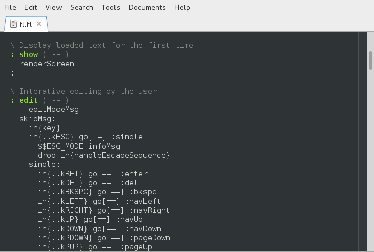

<head>
<title>Freeputer</title>
<meta http-equiv="content-type" content="text/html;charset=utf-8">
<meta name="keywords" content="Freeputer, Freelang, FreeLine, Robert Gollagher">
<meta name="description" content="The official Freeputer website"
</head>

# Freeputer

Freeputer ( ) \[ \] { } forever free

## What is Freeputer?

Freeputer is a free computer. [Free](http://www.fsf.org/) as in freedom.

Freeputer is a tiny virtual machine easily ported to most modern architectures, including bare metal, and requiring neither file system nor operating system. This offers extreme portability and the freedom to use software forever without designed obsolescence.

* Freeputer is a virtual machine: the Freeputer Virtual Machine (FVM).
* Freeputer is a self-hosted, self-contained software development platform.
* Freeputer is a platform for modular software that lasts forever.
* Freeputer is a powerful platform for bare metal computing.
* Freeputer is a user's computer not a vendor's computer.
* Freeputer supports the freedom of the user.
* Freeputer is a not an operating system.

## History

Freeputer is brand new. It was released on 8 August 2015.

Freeputer and Freelang are the product of several years of independent research by Robert Gollagher. Although the current implementation is brand new, the general design concept has been well proven by earlier prototypes. The Freelang language is stable and productive.

## Freeputer says 你好 ...

Here is the output from a simple Freeputer program:

As you can see, the program greets the user in Chinese and English.

The compiled program is 276 *bytes* in size. It requires neither an operating system nor a file system. It was written in Freelang, a stack-oriented, concatenative, compiled language for Freeputer. The Freelang compiler is self-hosted; that is, it is written in Freelang, runs on the FVM and can compile itself.

## Freeputer edits text ...

You can create, edit, compile and run programs on Freeputer instances. For example, the FreeLine text editor is written in Freelang and runs on Freeputer. It is accessed from a terminal emulator.

Here is FreeLine being used to edit the source code for itself:

For comparison, here's the same code in [gedit](https://en.wikipedia.org/wiki/Gedit):

## The future

Freeputer and Freelang are free and extensible.

What will you make with Freeputer?

## For further details

Please visit the Freeputer project on [GitHub](https://github.com/RobertGollagher/Freeputer) or [BitBucket](https://bitbucket.org/RobertGollagher/freeputer/src).

---

Copyright © Robert Gollagher 2015  
This document was written by Robert Gollagher.  
This document was first published on 7 August 2015.  
This document was last updated on 8 August 2015 at 18:10.  
This document is licensed under a [Creative Commons Attribution-ShareAlike 4.0 International License](http://creativecommons.org/licenses/by-sa/4.0/).

The official Freeputer website is [freeputer.net](http://www.freeputer.net).  
Robert Gollagher may be reached at

---
