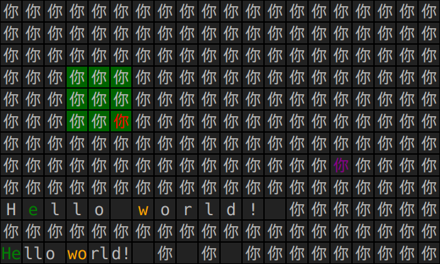

<meta http-equiv="content-type" content="text/html;charset=utf-8">

# The Standard Grid

The standard grid is a portable textual user interface (TUI). It is the recommended default user interface for Freeputer. It is relatively simple and easy to implement, even on bare metal (without an operating system), and has minimal hardware requirements. Therefore it can be expected to still be available long after current display devices and current operating systems are no longer available. This facilitates hardware and software freedom.

You do not have to use the standard grid with Freeputer. You can use any user interfaces you wish. However, it is wise to design your Freeputer programs to at least be capable of using the standard grid to some useful extent.

You should imagine the standard grid to be a standard device for text display and text input. The characters inputted by the user are not directly echoed to the display but are simply sent to whatever interactive program is connected to the grid. Your interactive program responds to that input and then sends commands to the grid so as to update the user interface appropriately.

It is convenient to use the grid as a system console or as a user interface for interactive programs running locally or remotely. You can wrap the grid in a program of your own to implement other communication protocols.

The mandatory characteristics of the standard grid are:

- it uses a fixed-width font;
- it can display all 7-bit ASCII characters;
- its logical size is exactly 40 columns by 12 rows (480 cells);
- column is specified by a single byte;
- row is specified by a single byte;
- a character is displayed by specifying column, row, then UTF-8 code;
- unsupported characters are substituted by a displayed standard character;
- half-width characters (such as 'A') occupy exactly 1 column (1 cell);
- full-width characters (such as '好') occupy exactly 2 columns (2 cells);
- full-width characters should only be added to odd-numbered columns;
- columns are numbered 1 to 40 (left to right);
- rows are numbered 1 to 12 (top to bottom);
- column 0 is reserved for 'zero commands';
- row 0 is reserved for 'zero commands';
- 'zero commands' exist (e.g. clear screen: row=0, column=0, char=0);
- all user input is treated as UTF-8 code only (never as key codes);
- all display is plain text (no text formatting other than colour).

The optional characteristics of the standard grid are:

- it can display many Unicode characters (not just 7-bit ASCII);
- it can support colour (foreground and background colours per cell);
- its physical size may be smaller than its logical size.

Wherever reasonably possible, you should aim to make your programs usable even when a standard grid does not support these optional characteristics. That is, when 'zero commands' for changing the current foreground and background colours have no effect and/or when the grid can only display 7-bit ASCII or only a small subset of Unicode characters. For most programs these optional characteristics should be seen as enhancements rather than as mandatory requirements for usability. There are obvious exceptions to this rule, such as when language requirements demand extensive Unicode support or when colour is an essential part of an application. When a highly sophisticated user interface is needed it may be better to use the standard grid for control purposes and render an additional second user interface using technology more sophisticated than that of the simple, portable standard grid.

## Screenshots

These screenshots are of grids implemented in JavaFX (see `Grid.java`) and running on Linux.

")

")

## Non-standard Grids

The most common form of non-standard grid is that which is in every way the same as a standard grid except that its logical size is smaller or larger, up to a convenient maximum of 255 columns by 255 rows (65025 cells).

The standard grid of 40 columns by 12 rows is the recommended default user interface for Freeputer. This size is small enough to be easy to implement on simple devices without requiring an operating system, and small enough to be useful on mobile devices, yet large enough to be useful on powerful desktop computers and large enough to be used for some text editing and some software development. This size has also been carefully chosen so as to encourage simplicity but without being simplistic. Please remember that the standard grid is not intended to be the only user interface for Freeputer but rather the default user interface. It is expected to be normal to have multiple user interfaces connected to a Freeputer instance simultaneously; for example, you might issue commands in the standard grid that drive a highly sophisticated graphical user interface in a web browser or in a window using hardware graphics acceleration, all connected to your Freeputer instance.

For Freeputer, it is strongly recommended that programs written for non-standard grids should also be usable on a standard grid.

## Beyond Freeputer

Grids are a much simpler, easier and more portable alternative to ncurses and ANSI terminal emulators for creating textual user interfaces and it is easy to use grids from any programming language, either locally or remotely.

The supplied reference implementation of `Grid`, in JavaFX, can easily be used by any native program as its user interface simply by using the supplied utilities in the `com.freeputer.io.util` package (such as `Encircle` or `ClientEnsock`) to invoke the native program and connect it to the grid.

---

Copyright © Robert Gollagher 2016  

This document was written by Robert Gollagher.  
This document was first published on 28 December 2016.  
This document was last updated on 28 January 2017 at 15:13.  
This document is licensed under a [Creative Commons Attribution-ShareAlike 4.0 International License](http://creativecommons.org/licenses/by-sa/4.0/).

The official Freeputer website is [freeputer.net](http://www.freeputer.net).

---
